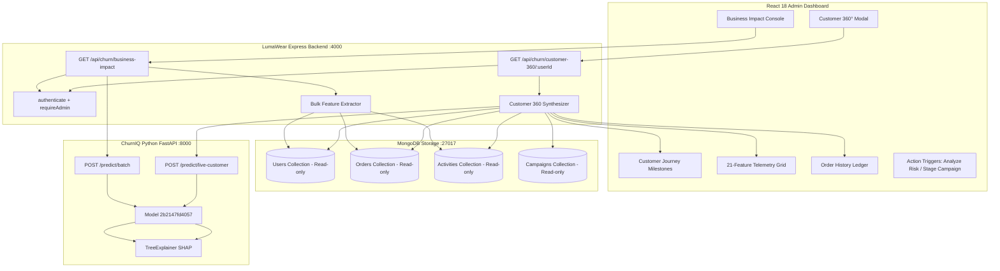

# Phase 10 — Business Impact Analytics & Customer 360° Intelligence

## 1. Executive Summary & Business Problem

In machine learning applications for customer churn, calculating a churn probability $P(\text{churn}) \in [0, 1]$ and identifying statistical SHAP drivers is only the diagnostic first half of the problem. Store operators and marketing executives need to answer two critical business questions:

1. **"How much business value is currently exposed to churn across our customer portfolio?"**
2. **"Why is this particular customer at risk, and what is their complete 360° relationship with LumaWear?"**

Phase 10 connects predictive inference directly to **Business Value Quantification** and **Customer Relationship Context**:
- **Business Impact Analytics (Revenue-at-Risk)**: Estimates the exposure of historical customer spend to predicted churn risk ($\sum \text{spend}_i \times P(\text{churn}_i)$) across risk tiers without claiming deterministic future loss.
- **Customer 360° Intelligence View**: Assembles a read-only CRM intelligence profile combining profile metadata, risk scorecards, chronological journey milestones, 21-feature behavioral telemetry, historical orders, recent activity logs, and targeted campaign context.

---

## 2. Revenue-at-Risk Methodology & Mathematical Framework

### A. Core Mathematical Formula
For any scored customer $i$, let:
- $\text{Spend}_i$: Historical lifetime customer spend (derived from completed orders in MongoDB).
- $P_i = P(\text{churn}_i)$: The continuous 90-day churn probability estimated by the active XGBoost model (`2b2147fd4057`).

The individual estimated revenue at risk is defined as:
$$\text{RevenueAtRisk}_i = \text{Spend}_i \times P_i$$

### B. Portfolio-Wide Aggregations
1. **Total Customer Value**:
   $$\text{TotalCustomerValue} = \sum_{i=1}^{N} \text{Spend}_i$$

2. **Total Estimated Revenue at Risk**:
   $$\text{EstimatedRevenueAtRisk} = \sum_{i=1}^{N} (\text{Spend}_i \times P_i)$$

3. **Revenue-at-Risk Percentage**:
   $$\text{RevenueAtRiskPercentage} = \left( \frac{\text{EstimatedRevenueAtRisk}}{\text{TotalCustomerValue}} \right) \times 100$$

4. **High-Risk Exposed Spend** (Customers in High or Very High tiers where $P_i \ge 0.50$):
   $$\text{HighRiskRevenueExposed} = \sum_{i \in \text{High} \cup \text{VeryHigh}} \text{Spend}_i$$

5. **High-Risk Revenue at Risk**:
   $$\text{HighRiskRevenueAtRisk} = \sum_{i \in \text{High} \cup \text{VeryHigh}} (\text{Spend}_i \times P_i)$$

6. **Very High Risk Revenue at Risk** ($P_i \ge 0.75$):
   $$\text{VeryHighRiskRevenueAtRisk} = \sum_{i \in \text{VeryHigh}} (\text{Spend}_i \times P_i)$$

7. **Average Spend per At-Risk Customer**:
   $$\overline{\text{Spend}}_{\text{AtRisk}} = \frac{\text{HighRiskRevenueExposed}}{N_{\text{HighRisk}}}$$

---

## 3. Assumptions & Limitations

> [!IMPORTANT]
> **Analytical Estimate vs. Guaranteed Loss**:
> - **Estimate Nature**: $\text{RevenueAtRisk}$ is an exposure metric based on historical spend weighted by current churn likelihood.
> - **Non-Deterministic**: It is **not** a guaranteed forecast of future revenue loss or a forward-looking revenue guarantee.
> - **Stationarity Assumption**: Assumes historical purchasing volume correlates with potential future lifetime value.
> - **Disclaimer**: The system explicitly embeds and displays:
>   *"Estimated Revenue at Risk is calculated from historical customer spend multiplied by predicted churn probability. It is an analytical estimate and does not represent guaranteed future revenue loss."*

---

## 4. Customer 360° Intelligence Architecture



---

## 5. API Contracts & Specifications

### A. `GET /api/churn/business-impact`
- **Security**: Requires JWT Access Token + `role === 'admin'`.
- **Response Schema**:
  ```json
  {
    "success": true,
    "summary": {
      "totalCustomerValue": 24890.50,
      "estimatedRevenueAtRisk": 8420.15,
      "revenueAtRiskPercentage": 33.83,
      "averageChurnProbability": 0.3842,
      "highRiskCustomerCount": 14,
      "highRiskRevenueExposed": 12450.00,
      "highRiskRevenueAtRisk": 7120.40,
      "veryHighRiskRevenueAtRisk": 3890.10,
      "averageRevenuePerAtRiskCustomer": 889.28,
      "highestValueAtRiskCustomer": { ... },
      "totalCustomers": 45,
      "scoredCustomers": 45
    },
    "tierBreakdown": {
      "low": { "customerCount": 18, "percentageOfCustomers": 40.0, "totalHistoricalSpend": 6200.00, "revenueAtRisk": 640.20, "percentageOfRevenueAtRisk": 7.6, "averageProbability": 0.1032 },
      "medium": { "customerCount": 13, "percentageOfCustomers": 28.9, "totalHistoricalSpend": 6240.50, "revenueAtRisk": 2340.10, "percentageOfRevenueAtRisk": 27.8, "averageProbability": 0.3750 },
      "high": { "customerCount": 9, "percentageOfCustomers": 20.0, "totalHistoricalSpend": 7500.00, "revenueAtRisk": 4650.30, "percentageOfRevenueAtRisk": 55.2, "averageProbability": 0.6200 },
      "very_high": { "customerCount": 5, "percentageOfCustomers": 11.1, "totalHistoricalSpend": 4950.00, "revenueAtRisk": 4129.55, "percentageOfRevenueAtRisk": 49.0, "averageProbability": 0.8342 }
    },
    "topValueAtRiskCustomers": [ ... ],
    "generatedAt": "2026-08-26T11:50:00.000Z",
    "disclaimer": "Estimated Revenue at Risk is calculated from historical customer spend multiplied by predicted churn probability. It is an analytical estimate and does not represent guaranteed future revenue loss."
  }
  ```

### B. `GET /api/churn/customer-360/:userId`
- **Security**: Requires JWT Access Token + `role === 'admin'`.
- **Response Schema**:
  ```json
  {
    "success": true,
    "profile": {
      "userId": "66c8a...",
      "name": "Alex Johnson",
      "email": "alex@example.com",
      "role": "customer",
      "accountCreated": "2026-06-01T08:00:00.000Z",
      "tenureDays": 86
    },
    "risk": {
      "churnProbability": 0.7842,
      "churnPercentage": 78.42,
      "riskLevel": "Very High",
      "churnTimeline": "Critical churn risk within 90 days",
      "topSHAPDrivers": [
        {
          "feature": "days_since_last_activity",
          "label": "Days Since Last Activity",
          "shap_value": 0.642,
          "direction": "increases_churn",
          "description": "Days since the user recorded any browsing, cart, wishlist, or order event."
        }
      ],
      "recommendations": [ ... ]
    },
    "businessMetrics": {
      "totalSpend": 1240.50,
      "orderCount": 4,
      "averageOrderValue": 310.13,
      "lastOrderDate": "2026-07-10T14:22:00.000Z",
      "lastActivityDate": "2026-07-28T09:15:00.000Z",
      "estimatedRevenueAtRisk": 972.80
    },
    "journey": [
      { "step": 1, "type": "account_created", "title": "Account Created", "timestamp": "...", "detail": "...", "icon": "🌱" },
      { "step": 2, "type": "first_activity", "title": "First Recorded Activity", "timestamp": "...", "detail": "...", "icon": "🧭" },
      { "step": 3, "type": "product_browsing", "title": "Catalog Browsing", "timestamp": "...", "detail": "...", "icon": "👀" },
      { "step": 4, "type": "intent_signal", "title": "Item Added to Cart", "timestamp": "...", "detail": "...", "icon": "🛒" },
      { "step": 5, "type": "first_order", "title": "First Order Placed", "timestamp": "...", "detail": "...", "icon": "🛍️" },
      { "step": 8, "type": "current_risk", "title": "Current Churn Risk: Very High", "timestamp": "...", "detail": "...", "icon": "🚨" }
    ],
    "telemetry": {
      "engagement": [ ... 10 features ... ],
      "purchasing": [ ... 9 features ... ],
      "customerProfile": [ ... 2 features ... ],
      "rawFeatures": { ... }
    },
    "orders": [ ... read-only historical orders ... ],
    "activities": [ ... read-only latest 50 events ... ],
    "retentionContext": {
      "applicableClusters": [ ... ],
      "targetedCampaigns": [ ... ],
      "primaryRecommendedAction": "Send personalized re-engagement discount."
    }
  }
  ```

---

## 6. Performance & Security Verification

1. **Elimination of N+1 Queries**:
   - `GET /api/churn/business-impact` uses a single `$in: userIds` query for orders and activities, resolving in $O(1)$ database query roundtrips.
   - Vectorized `POST /predict/batch` scores all customers in a single parallel HTTP call.
2. **Database Immutability**:
   - All collections (`users`, `orders`, `activities`, `campaigns`) are accessed strictly read-only.
3. **Active Model Integrity**:
   - Active model ID strictly maintained as `2b2147fd4057`.
