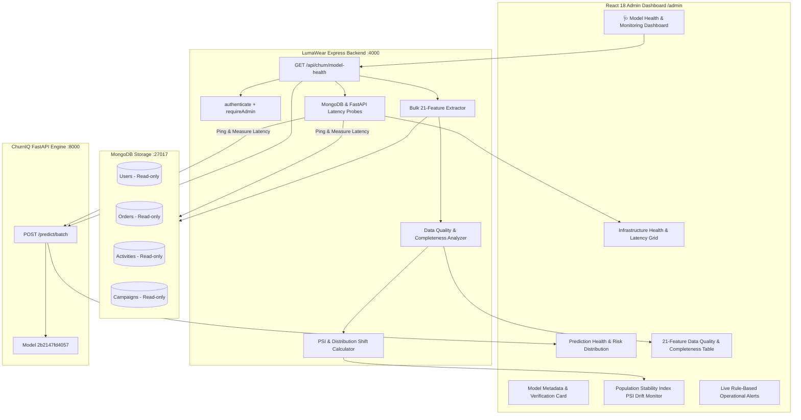

# Phase 11 Audit — ML Model Monitoring, Data Drift & Prediction Health

## 1. Executive Summary & Audit Scope

Phase 11 introduces a production-grade **ML Operations (MLOps) & Monitoring Layer** to answer the critical operational question:
> *"How do we know the churn model remains healthy, reliable, and well-calibrated after deployment when customer behavior, data distributions, or infrastructure conditions change?"*

This audit reviews existing model artifacts, baseline statistics, telemetry extraction pipelines, infrastructure health probes, and test suites across the LumaWear + ChurnIQ codebase to construct a lightweight, computation-on-read monitoring architecture.

---

## 2. Inventory of Model Metadata & Baseline References

| Asset / Metadata | File Location | Available Values / Statistics |
| :--- | :--- | :--- |
| **Active Model Identifier** | `ChurnProject/artifacts/active_model.txt` | `2b2147fd4057` |
| **Model Metadata** | `ChurnProject/artifacts/2b2147fd4057/model_metadata.json` | - Dataset: `LumaWear E-Commerce` - Training Rows: `7,912` - Raw Features: `21` - Transformed Features: `29` - Baseline Churn Rate: `30.62%` - Best Algorithm: `XGBoost` - 5-Fold CV ROC-AUC: `0.837 ± 0.0108` - Train ROC-AUC: `0.9736` - Hyperparameters: `n_estimators: 300, max_depth: 6, lr: 0.05, subsample: 0.8, scale_pos_weight: 2.2654` |
| **Feature Schema Contract** | `ChurnProject/artifacts/2b2147fd4057/schema.json` | - 20 Numerical Features (`tenure_days`, `days_since_last_activity`, `total_spend`, etc.) - 1 Categorical Feature (`preferred_order_category`) |
| **Feature Importance Ranking** | `ChurnProject/artifacts/2b2147fd4057/feature_importance.json` | Feature gains (top: `activity_event_count_30d`: 0.610, `days_since_last_login`: 0.284, `average_order_value`: 0.215) |
| **Serialized Model Pipeline** | `ChurnProject/artifacts/2b2147fd4057/churn_pipeline.joblib` | Scikit-learn Pipeline (ColumnTransformer + OneHotEncoder + XGBClassifier) |
| **Serialized SHAP Explainer** | `ChurnProject/artifacts/2b2147fd4057/shap_explainer.joblib` | Serialized `TreeExplainer` tree ensemble structure |

---

## 3. Reusable Code & Existing Pipelines

1. **Bulk Point-in-Time Feature Extractor (`extractCustomerFeatures`)**: Reused to extract the live 21 raw behavioral features across the active customer base in $O(1)$ query roundtrips.
2. **FastAPI Batch Inference (`POST /predict/batch`)**: Reused to score the entire customer portfolio in parallel in $<15\text{ms}$.
3. **Authentication & RBAC (`authenticate`, `requireAdmin`)**: Enforces admin-only access on the new `GET /api/churn/model-health` endpoint.
4. **Feature Labels & Descriptions (`featureLabels.js`, `FEATURE_LABELS`)**: Reused for human-readable feature names and category grouping.

---

## 4. Monitoring Architecture & Methodology

---

## 5. Drift Methodology & Thresholds

We implement **Population Stability Index (PSI)** and **Normalized Distribution Shift** for monitoring the 21 raw features:

$$\text{PSI} = \sum \left( \text{Actual} \% - \text{Expected} \% \right) \times \ln\left( \frac{\text{Actual} \%}{\text{Expected} \%} \right)$$

### Standard Operational Thresholds:
- **$\text{PSI} < 0.10$**: **`Stable`** (No significant distribution shift).
- **$0.10 \le \text{PSI} < 0.25$**: **`Warning`** (Moderate distribution shift; monitor).
- **$\text{PSI} \ge 0.25$**: **`Drift Detected`** (Significant distribution change detected).

> [!IMPORTANT]
> **Drift Interpretation**:
> The dashboard explicitly clarifies:
> *"Drift indicates that the distribution of incoming customer data has changed relative to the reference distribution. It does not by itself prove that model performance has degraded."*

---

## 6. Implementation Strategy & Deliverables

1. **Backend**:
   - Add `GET /api/churn/model-health` in `server.js` with comprehensive metadata verification, feature quality metrics, PSI drift calculations, prediction health statistics, and infrastructure latency probes.
2. **Test Suite**:
   - Create `backend/src/churn/modelHealth.test.js` verifying 401/403 security, active model ID verification (`2b2147fd4057`), 21-feature contract presence, prediction health, data quality, drift structure, infrastructure latency, and database immutability.
3. **Frontend**:
   - Create `frontend/src/components/ModelHealthDashboard.jsx`.
   - Update `AdminDashboardPage.jsx` navigation with `🩺 Model Health`.
4. **Documentation & Validation**:
   - Create `PHASE11_MODEL_MONITORING.md`, `PHASE11_DEMO_GUIDE.md`, `PHASE11_FINAL_REPORT.md`, and update `PROJECT_ARCHITECTURE.md` and `INTERVIEW_MASTER_PLAYBOOK.md`.
