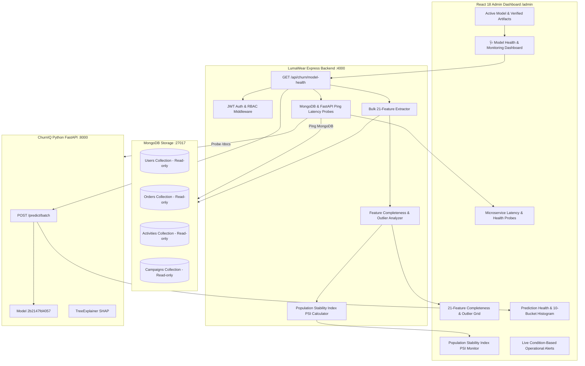

# Phase 11 — ML Model Monitoring, Data Drift & Prediction Health

## 1. Executive Summary & Operational Objective

Deploying a Machine Learning model into production is only the beginning of the model lifecycle. Over time, changes in customer purchasing habits, seasonal apparel trends, marketing campaigns, and frontend telemetry can cause the statistical properties of incoming features to diverge from the original training distribution.

Phase 11 introduces a lightweight, production-grade **ML Operations (MLOps) & Health Monitoring Layer** for the LumaWear + ChurnIQ system.

Store administrators can answer:
1. **"Is the active XGBoost model (`2b2147fd4057`) running reliably with all required artifacts verified?"**
2. **"Are our microservices (Express, FastAPI, MongoDB) healthy and responding within latency SLAs?"**
3. **"Is incoming live customer data experiencing statistical data drift relative to the 7,912 training baseline?"**
4. **"Are feature missingness, sparsity, and prediction calibration within normal operational bounds?"**

---

## 2. Monitoring Architecture & Pipeline Topology



---

## 3. Data Drift Methodology & Population Stability Index (PSI)

Data drift is measured by comparing the probability distribution of incoming live customer features against the reference baseline distribution recorded during training ($N = 7,912$ historical snapshots).

### Population Stability Index (PSI) Formula:
$$\text{PSI} = \sum_{k=1}^{B} \left( \text{Actual}_k - \text{Expected}_k \right) \times \ln\left( \frac{\text{Actual}_k}{\text{Expected}_k} \right)$$

### Standard Operational Thresholds:
| PSI Score Range | Status | Operational Action |
| :--- | :--- | :--- |
| **$\text{PSI} < 0.10$** | **`Stable`** | No significant distribution change; normal inference. |
| **$0.10 \le \text{PSI} < 0.25$** | **`Warning`** | Moderate distribution shift; monitor upcoming batches. |
| **$\text{PSI} \ge 0.25$** | **`Drift Detected`** | Significant distribution shift detected; investigate feature pipeline or evaluate retraining. |

> [!IMPORTANT]
> **Drift is Not Error**:
> The system explicitly labels drift as:
> *"Distribution change detected relative to reference baseline. It does not by itself prove that model performance has degraded."*

---

## 4. API Contract & Schema

### `GET /api/churn/model-health`
- **Security**: Requires JWT Access Token + `role === 'admin'`.
- **Response Structure**:
  ```json
  {
    "success": true,
    "model": {
      "activeModelId": "2b2147fd4057",
      "algorithm": "XGBoost Classifier + TreeSHAP",
      "datasetName": "LumaWear E-Commerce (7,912 training snapshots)",
      "trainingRows": 7912,
      "rawFeatureCount": 21,
      "transformedFeatureCount": 29,
      "cvRocAuc": 0.837,
      "cvRocAucStd": 0.0108,
      "trainRocAuc": 0.9736,
      "churnRate": 30.62,
      "artifactIntegrity": {
        "pipeline": true,
        "shapExplainer": true,
        "schema": true,
        "featureOrder": true,
        "metadata": true
      }
    },
    "infrastructure": {
      "express": { "service": "LumaWear Express REST Gateway", "status": "HEALTHY", "latencyMs": 1 },
      "fastapi": { "service": "ChurnIQ FastAPI Inference Engine", "status": "HEALTHY", "latencyMs": 14 },
      "mongodb": { "service": "MongoDB Database Store", "status": "HEALTHY", "latencyMs": 2 }
    },
    "latency": {
      "featureExtractionLatencyMs": 8,
      "batchInferenceLatencyMs": 12,
      "totalAnalyticsLatencyMs": 22,
      "latencyAssessment": "Optimal (< 250ms)"
    },
    "dataQuality": {
      "customersScanned": 45,
      "customersScored": 45,
      "sparseCustomerCount": 3,
      "zeroOrderCustomerCount": 7,
      "zeroActivityCustomerCount": 2,
      "featureQuality": [
        {
          "feature": "activity_event_count_30d",
          "label": "30-Day Activity Events",
          "category": "engagement",
          "missingCount": 0,
          "missingPercentage": 0.0,
          "min": 0,
          "median": 12.0,
          "mean": 14.5,
          "max": 85,
          "status": "Optimal"
        }
      ]
    },
    "drift": {
      "summary": {
        "stableFeatureCount": 21,
        "warningFeatureCount": 0,
        "driftedFeatureCount": 0,
        "totalFeaturesEvaluated": 21
      },
      "features": [ ... 21 features sorted by PSI descending ... ],
      "disclaimer": "Drift indicates that the distribution of incoming customer data has changed relative to the reference distribution. It does not by itself prove that model performance has degraded."
    },
    "predictionHealth": {
      "totalPredictions": 45,
      "successfulPredictions": 45,
      "failedPredictions": 0,
      "successRate": 100.0,
      "averageProbability": 0.3842,
      "medianProbability": 0.3210,
      "riskTiers": { "low": 18, "medium": 13, "high": 9, "veryHigh": 5 },
      "distributionHistogram": [
        { "range": "0.0–0.1", "count": 8, "percentage": 17.8 },
        { "range": "0.1–0.2", "count": 10, "percentage": 22.2 }
      ]
    },
    "alerts": [
      {
        "type": "success",
        "title": "Inference Engine Healthy",
        "message": "FastAPI responded in 14ms. XGBoost pipeline (2b2147fd4057) is operational."
      }
    ],
    "generatedAt": "2026-08-26T12:00:00.000Z"
  }
  ```

---

## 5. Security & Isolation Model

1. **Strict Immutability**: All collections (`users`, `orders`, `activities`, `campaigns`) and model artifacts (`artifacts/2b2147fd4057`) are accessed strictly read-only.
2. **Computation-on-Read**: Monitoring metrics are synthesized on-demand without writing telemetry metrics into production transactional tables.
3. **No Information Leaks**: Internal connection URIs, database credentials, filesystem paths, and Python stack traces are never exposed in JSON responses.
