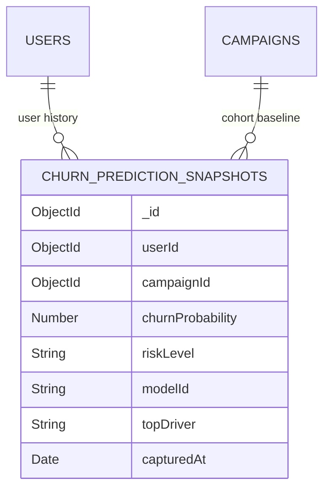

# Phase 12 Audit — Retention Effectiveness & Experiment Analytics

## 1. Executive Summary & Audit Scope

Phase 12 addresses the ultimate business question in the churn intelligence lifecycle:
> *"We predicted churn, recommended retention actions, and staged campaigns. How can the business measure whether those interventions were effective?"*

This audit identifies reusable components across Phases 4–11, reviews campaign schemas, examines prediction snapshots, and establishes an isolated, non-mutating architecture for tracking risk movement, observational campaign performance, A/B simulation, and ROI projections.

---

## 2. Reusable Architecture & Component Inventory

| Component / Utility | File Location | Existing Capability | Phase 12 Reuse Strategy |
| :--- | :--- | :--- | :--- |
| **Authentication & RBAC** | `server.js` | `authenticate`, `requireAdmin` | Protects `/api/churn/campaign-effectiveness` and `/api/churn/risk-movement/:userId` |
| **Campaign Schema** | `server.js` (Mongoose `Campaign`) | Stored in isolated `campaigns` collection with `targetCustomerIds`, `type`, `priority`, `status` | Query active/completed campaigns to evaluate target cohorts and baseline risks |
| **Bulk Feature Extraction** | `src/churn/features.js` | `extractCustomerFeatures` | Computes live point-in-time features for target customers in $O(1)$ query roundtrips |
| **Batch Prediction Engine** | FastAPI `:8000` (`POST /predict/batch`) | Vectorized C-level scoring with SHAP explanations | Evaluates current risk probabilities for all targeted campaign cohorts |
| **Feature Formatting** | `config/featureLabels.js` | `formatFeatureLabel`, `getFeatureDisplay` | Human-readable SHAP driver formatting in Before vs After comparisons |
| **Admin Dashboard** | `AdminDashboardPage.jsx` | 6 navigation tabs with sub-modal states | Add 7th tab `📈 Retention Effectiveness` and wire `RiskMovementModal` |

---

## 3. Data Schema: Prediction Snapshots (`churn_prediction_snapshots`)

To enable observational before-vs-after risk tracking without modifying `users`, `orders`, `activities`, or `campaigns`, we introduce an isolated collection: `churn_prediction_snapshots`.



### Schema Definition:
```javascript
const ChurnPredictionSnapshotSchema = new mongoose.Schema({
  userId: { type: mongoose.Schema.Types.ObjectId, ref: "User", required: true, index: true },
  campaignId: { type: mongoose.Schema.Types.ObjectId, ref: "Campaign", default: null, index: true },
  churnProbability: { type: Number, required: true },
  riskLevel: { type: String, enum: ["Low", "Medium", "High", "Very High"], required: true },
  modelId: { type: String, default: "2b2147fd4057" },
  topDriver: { type: String, default: "30-Day Activity Events" },
  capturedAt: { type: Date, default: Date.now, index: true },
});
```

---

## 4. Analytical Distinction: Observational Risk Movement vs. Causal Attribution

> [!IMPORTANT]
> **No Spurious Causal Claims**:
> The system explicitly differentiates between:
> 1. **Observational Risk Movement**: Measured change in model churn probability ($P_{\text{baseline}} - P_{\text{latest}}$).
> 2. **Causal Incrementality**: Requires randomized A/B holdout testing (Treatment vs. Control) to account for natural customer self-recovery.

The dashboard includes clear disclaimers on all observational and simulated metrics.

---

## 5. Implementation Roadmap & Deliverables

1. **Backend**:
   - Register `ChurnPredictionSnapshot` model in `server.js`.
   - Implement `GET /api/churn/campaign-effectiveness`.
   - Implement `GET /api/churn/risk-movement/:userId`.
   - Automatically record baseline snapshots on campaign creation (`POST /api/churn/campaigns`).
2. **Frontend**:
   - Create `CampaignEffectivenessDashboard.jsx` (KPI cards, campaign performance comparison, distribution of risk delta).
   - Create `RiskMovementModal.jsx` (Before vs After comparison with SHAP drivers and risk transitions).
   - Create `ExperimentSimulator.jsx` (A/B testing framework).
   - Create `RetentionROISimulator.jsx` (Financial scenario planner).
   - Update `AdminDashboardPage.jsx` with `📈 Retention Effectiveness` tab.
3. **Testing**:
   - Create `backend/src/churn/retentionEffectiveness.test.js` verifying 401/403 security, campaign calculations, risk movement transitions, snapshot isolation, and database immutability.
4. **Documentation**:
   - Create `PHASE12_RETENTION_EFFECTIVENESS.md`, `PHASE12_DEMO_GUIDE.md`, `PHASE12_FINAL_REPORT.md`, update `PROJECT_ARCHITECTURE.md` and `INTERVIEW_MASTER_PLAYBOOK.md`.
