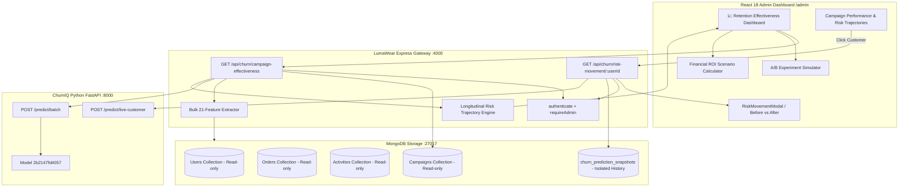

# Phase 12 — Retention Effectiveness & Experiment Analytics

## 1. Executive Summary & Core Objective

The ultimate value of predictive churn analytics lies not in predictions themselves, but in whether proactive retention interventions tangibly change customer risk trajectories and preserve customer lifetime value.

Phase 12 builds a production-grade **Retention Effectiveness & Experiment Analytics Layer** answering the fundamental business question:
> *"We predicted churn, recommended retention actions, and staged campaigns. How can the business measure whether those interventions were effective?"*

---

## 2. Analytical Architecture & Topology

---

## 3. Core Capabilities & Methodologies

### A. Campaign Performance Analytics (`GET /api/churn/campaign-effectiveness`)
- Evaluates each staged/sent/completed campaign across its target customer cohort.
- Measures:
  - `averageBaselineChurnProbability`: Average model probability when targeted.
  - `averageLatestChurnProbability`: Current live model probability.
  - `averageRiskChange`: Longitudinal delta ($P_{\text{baseline}} - P_{\text{latest}}$).
  - Risk direction counts: `customersWithReducedRisk`, `customersWithIncreasedRisk`, `customersWithUnchangedRisk`.
  - `effectiveReductionPercentage`: % of cohort achieving risk decrease.
  - `topRiskReducedCustomer`: Customer experiencing highest probability drop.

### B. Prediction Snapshots & Risk Movement (`churn_prediction_snapshots`)
- Isolated historical snapshot collection capturing:
  `{ userId, campaignId, churnProbability, riskLevel, modelId, topDriver, capturedAt }`.
- `GET /api/churn/risk-movement/:userId` reconstructs chronological risk snapshots and computes the Before vs. After transition (e.g. `Very High → Medium`).
- Prominently displays the observational notice:
  > *"Risk movement is an observed change in model prediction and does not by itself establish that a campaign caused the improvement."*

### C. A/B Experiment Simulator (`ExperimentSimulator.jsx`)
- Configurable simulation framework modeling randomized treatment vs. control holdout groups:
  $$\text{Incremental Conversions} = (N_T \times \text{CR}_T) - (N_T \times \text{CR}_C)$$
  $$\text{Incremental Revenue} = \text{Incremental Conversions} \times \text{AOV}$$
  $$\text{Estimated ROI} = \frac{\text{Incremental Revenue} - \text{Campaign Cost}}{\text{Campaign Cost}} \times 100\%$$

### D. Financial ROI Scenario Planner (`RetentionROISimulator.jsx`)
- Financial scenario calculator estimating budget, recovered customers, preserved revenue, and net return:
  $$\text{Recovered Customers} = N \times \text{Recovery Rate}$$
  $$\text{Recovered Revenue} = \text{Recovered Customers} \times \text{AOV}$$

---

## 4. API Reference

| Endpoint | Method | Security | Description |
| :--- | :--- | :--- | :--- |
| `/api/churn/campaign-effectiveness` | `GET` | `authenticate`, `requireAdmin` | Returns portfolio and campaign-level observational effectiveness metrics and top performers |
| `/api/churn/risk-movement/:userId` | `GET` | `authenticate`, `requireAdmin` | Returns Before-vs-After probability deltas, risk tier transitions, and snapshot timelines |

---

## 5. Security & Isolation Guarantees

1. **Non-Mutation of Transactional Data**: `users`, `orders`, `activities`, and existing `campaigns` collections are strictly read-only during analytics.
2. **Isolated Snapshot Writes**: Only the dedicated analytical collection `churn_prediction_snapshots` receives snapshot writes upon campaign staging.
3. **No Synthetic CSV Infiltration**: All live scores query MongoDB directly and score via FastAPI XGBoost artifact `2b2147fd4057`.
