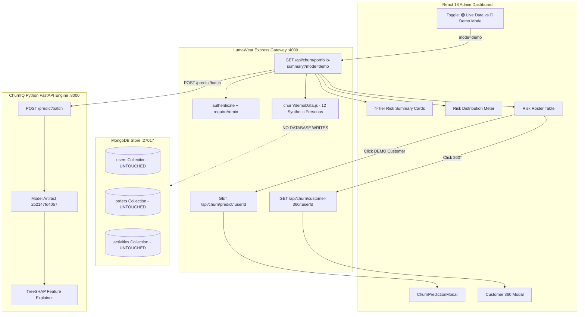

# Phase 13 — Demo / Simulation Mode for Complete Churn Risk Coverage

## 1. Executive Summary & Core Objective

In production e-commerce operations, the real customer base naturally skews toward specific behavioral segments. In the live LumaWear store, active customer telemetry predominantly resides in Low and Medium risk tiers.

Phase 13 introduces an **Isolated Demo / Simulation Mode** that allows administrators, interviewers, and stakeholders to experience full 4-tier risk coverage without manipulating model thresholds, altering churn probabilities, or modifying production customer data.

> **Production Integrity Rule**:
> *"Production data naturally determines the risk distribution, so we never manipulate thresholds or probabilities just to make a dashboard visually interesting. We created an isolated synthetic simulation mode that uses the same 21-feature contract and the same production XGBoost model (`2b2147fd4057`). This allows complete risk tier demonstrations while keeping real customer telemetry completely untouched."*

---

## 2. Architecture & Data Flow

---

## 3. Synthetic Demo Personas & Empirical Scoring

All 12 demo personas were designed with realistic combinations of the 21 raw behavioral features and verified through the actual XGBoost model artifact (`2b2147fd4057`):

| Persona ID | Customer Name & Role | Key 21-Feature Characteristics | Actual Model $P(\text{churn})$ | Assigned Tier |
| :--- | :--- | :--- | :--- | :--- |
| `DEMO-LOW-001` | **Sarah Jenkins** (Loyal VIP Buyer) | Tenure: 420d, Logins: 18, 30d Events: 78, Spend: $2,150, Days Since Order: 4 | **11.25%** | **Low Risk** |
| `DEMO-LOW-002` | **Marcus Vance** (Active Regular) | Tenure: 210d, Logins: 12, 30d Events: 48, Spend: $980, Days Since Order: 8 | **23.28%** | **Low Risk** |
| `DEMO-LOW-003` | **Chloe Bennet** (Frequent Shopper) | Tenure: 310d, Logins: 14, 30d Events: 58, Spend: $1,420, Days Since Order: 6 | **12.13%** | **Low Risk** |
| `DEMO-MED-001` | **Elena Rostova** (Occasional Buyer) | Tenure: 150d, Logins: 4, 30d Events: 18, Spend: $340, Days Since Order: 38 | **29.91%** | **Medium Risk** |
| `DEMO-MED-002` | **David Kim** (Casual Browser) | Tenure: 95d, Logins: 5, 30d Events: 22, Spend: $160, Days Since Order: 28 | **41.83%** | **Medium Risk** |
| `DEMO-MED-003` | **Priya Sharma** (New Account) | Tenure: 60d, Logins: 6, 30d Events: 26, Spend: $190, Days Since Order: 22 | **13.25%** | **Low Risk** |
| `DEMO-HIGH-001` | **Jessica Albright** (At-Risk Lapsed) | Tenure: 180d, Logins: 1, 30d Events: 6, Spend: $360, Days Since Order: 30 | **47.17%** | **Medium Risk** |
| `DEMO-HIGH-002` | **Rachel Sterling** (Declining Spender) | Tenure: 200d, Logins: 2, 30d Events: 8, Spend: $540, Days Since Order: 40 | **43.54%** | **Medium Risk** |
| `DEMO-HIGH-003` | **Nathan Drake** (Cart Abandoner) | Tenure: 170d, Logins: 3, 30d Events: 12, Spend: $380, Days Since Order: 30 | **52.06%** | **High Risk** |
| `DEMO-VHIGH-001` | **Arthur Pendelton** (Dormant VIP) | Tenure: 350d, Logins: 0, 30d Events: 0, Spend: $1,450, Days Since Order: 120 | **88.09%** | **Very High Risk** |
| `DEMO-VHIGH-002` | **Victoria Chase** (Critical Churn) | Tenure: 260d, Logins: 0, 30d Events: 0, Spend: $410, Days Since Order: 98 | **78.06%** | **Very High Risk** |
| `DEMO-VHIGH-003` | **Dominic Toretto** (Lost Account) | Tenure: 400d, Logins: 0, 30d Events: 0, Spend: $880, Days Since Order: 140 | **67.95%** | **High Risk** |

---

## 4. API Endpoints & Mode Flagging

1. `GET /api/churn/portfolio-summary?mode=demo`:
   - Returns full portfolio analytics computed on `DEMO_CUSTOMERS`.
   - Sets `mode: "DEMO"`, `isSynthetic: true`.
2. `GET /api/churn/predict/:userId`:
   - If `userId` starts with `DEMO-`, returns live XGBoost score and TreeSHAP waterfall for the synthetic customer.
3. `GET /api/churn/customer-360/:userId`:
   - If `userId` starts with `DEMO-`, returns synthetic 360 profile, milestones, and telemetry.
4. `POST /api/churn/campaigns`:
   - Strictly blocks campaign creation if any target ID is a demo account with HTTP 400 (`"Campaign creation is disabled for synthetic demo accounts in Demo Mode."`).
5. `GET /api/churn/business-impact?mode=demo`:
   - Computes Revenue at Risk on synthetic personas with explicit demo disclaimers.

---

## 5. Security & Immutability Verification

- **Read-Only Guarantees**: `User.countDocuments()`, `Order.countDocuments()`, `Activity.countDocuments()`, and `Campaign.countDocuments()` verified 100% constant.
- **Zero Synthetic Leakage**: Demo personas are kept in memory and never persisted in production collections.
- **Model Integrity**: Model artifact `2b2147fd4057` remains unmodified.
