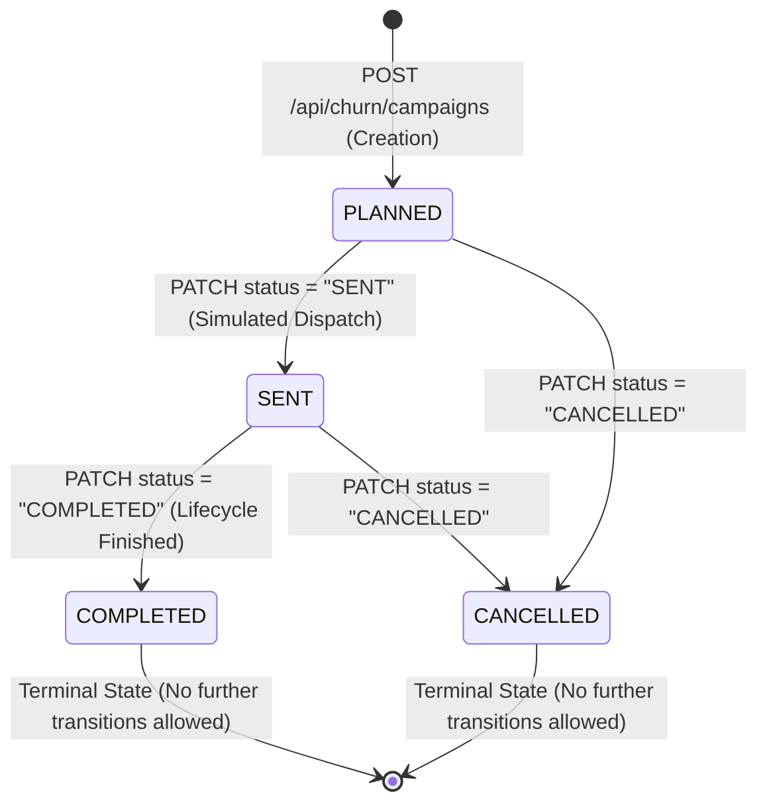

# Phase 9 — Retention Action Center

## 1. Executive Summary & Business Motivation

Prior to Phase 9, the LumaWear + ChurnIQ integration provided store administrators with predictive churn risk scoring and portfolio-wide risk analytics (Phases 1–8). While administrators could inspect aggregate distributions and feature explanations via SHAP, there was no bridge connecting **analytical risk discoveries to operational retention campaigns**.

**Phase 9 delivers the Retention Action Center**: a dedicated simulation and campaign management layer within the LumaWear Admin Dashboard. It transforms raw churn predictions and SHAP attributions into discrete, prioritized **Retention Opportunities** and **Action Clusters**, enabling store managers to:
1. Identify distinct customer segments requiring proactive intervention (Cart Abandonment, Inactivity, Wishlist Follow-up, VIP Retention, etc.).
2. Stage targeted retention cohorts using multi-criteria filtering, search, and selection checkboxes.
3. Preview campaign copy and business rationale in safe **Simulation Mode** (without dispatching live customer communications).
4. Persist structured campaign records in an isolated MongoDB `campaigns` collection.
5. Govern the complete campaign lifecycle through formal state transitions (`PLANNED` $\rightarrow$ `SENT` $\rightarrow$ `COMPLETED` / `CANCELLED`).

---

## 2. End-to-End System Topology

```mermaid
graph TD
    subgraph ClientLayer [React 18 Admin Dashboard /admin]
        OppSummary[Retention Opportunity Summary (Pool Size, Urgency Metrics)]
        ClusterSelector[Action Cluster Selector (7 Retention Strategies)]
        Workspace[Campaign Workspace (Multi-select Table, Search & Filter)]
        PreviewModal[CampaignPreviewModal (Simulation Template & Staging)]
        HistoryView[CampaignHistory (Status Transitions & Audit Trail)]
        DrillDownModal[ChurnPredictionModal (Single Customer SHAP Telemetry)]
    end

    subgraph ExpressGateway [LumaWear Node/Express Backend :4000]
        AuthMW[authenticate + requireAdmin Middleware]
        OppEndpoint[GET /api/churn/retention-opportunities]
        CreateCampEndpoint[POST /api/churn/campaigns]
        ListCampEndpoint[GET /api/churn/campaigns]
        StatusCampEndpoint[PATCH /api/churn/campaigns/:campaignId/status]
        ClusterEngine[Action Cluster Synthesis Engine]
        BulkExtractor[Bulk MongoDB Feature Extractor]
    end

    subgraph Storage [MongoDB Database :27017]
        UsersColl[(users Collection - Read-only)]
        OrdersColl[(orders Collection - Read-only)]
        ActivitiesColl[(activities Collection - Read-only)]
        CampaignColl[(campaigns Collection - NEW Isolated Store)]
    end

    subgraph MLEngine [ChurnIQ Python FastAPI Engine :8000]
        BatchPredict[POST /predict/batch]
        ActiveModel[XGBoost Pipeline 2b2147fd4057]
        SHAPTree[TreeExplainer SHAP Engine]
        Recommender[Retention Rules Synthesizer]
    end

    OppSummary --> ClusterSelector
    ClusterSelector --> Workspace
    Workspace -->|Click Preview Campaign| PreviewModal
    PreviewModal -->|Click Create Campaign| CreateCampEndpoint
    CreateCampEndpoint --> CampaignColl
    HistoryView --> ListCampEndpoint
    HistoryView --> StatusCampEndpoint
    Workspace -->|Click Analyze Risk| DrillDownModal

    ClientLayer --> OppEndpoint
    OppEndpoint --> AuthMW
    OppEndpoint -->|1. Bulk Fetch Records| UsersColl
    UsersColl -->|2. Return Documents| BulkExtractor
    BulkExtractor -->|3. 21 Features per Customer| OppEndpoint
    OppEndpoint -->|4. POST /predict/batch| BatchPredict
    BatchPredict --> ActiveModel
    ActiveModel --> SHAPTree
    SHAPTree --> Recommender
    Recommender -->|5. Customer Predictions| OppEndpoint
    OppEndpoint --> ClusterEngine
    ClusterEngine -->|6. Opportunities & Clusters| OppSummary
```

---

## 3. Retention Opportunity Engine & Cluster Logic

The backend evaluates point-in-time features and live model outputs to map customers into 7 discrete retention clusters. A customer may match multiple clusters simultaneously; the system does not artificially constrain customers to a single bucket.

| Cluster ID | Title | Urgency Priority | Business Condition | Recommended Action |
| :--- | :--- | :--- | :--- | :--- |
| `cart_abandonment` | **Cart Abandonment Recovery** | **High** | $\text{cart\_actions\_30d} > 0$ and $\text{orders\_30d} == 0$ | Send an abandoned-cart reminder with a time-limited incentive or free shipping offer. |
| `inactivity_reengagement` | **Inactivity Re-engagement** | **High** | $\text{days\_since\_last\_activity} \ge 14$ or $\text{days\_since\_last\_login} \ge 14$ | Trigger a personalized win-back campaign with curated collections and exclusive comeback perks. |
| `wishlist_followup` | **Wishlist Follow-up** | **Medium** | $\text{wishlist\_actions\_30d} > 0$ and $\text{orders\_30d} == 0$ | Send tailored price-drop or low-stock alerts for saved wishlist favorites. |
| `product_recommendation` | **Product Recommendations** | **Medium** | $\text{product\_views\_30d} \ge 5$ and $\text{orders\_30d} == 0$ | Send personalized product recommendations based on recently viewed catalog items. |
| `new_customer_onboarding` | **New Customer Onboarding** | **Medium** | $\text{tenure\_days} \le 14$ and $\text{order\_count} \le 1$ | Deliver an onboarding series highlighting bestsellers and a second-purchase reward. |
| `vip_retention` | **VIP Retention** | **High** | $\text{total\_spend} \ge \$400$ and ($P_{\text{churn}} \ge 0.45$ or Risk is High/Very High) | Deliver high-touch VIP outreach with priority concierge support and loyalty tier bonuses. |
| `category_promotion` | **Category-Based Promotion** | **Low** | Customer has a valid non-empty `preferred_order_category` | Promote seasonal new arrivals and exclusive deals in their preferred product category. |

---

## 4. Campaign Data Model & Lifecycle State Machine

Campaigns are persisted exclusively in a dedicated, isolated `campaigns` collection in MongoDB. Existing `users`, `orders`, and `activities` collections are strictly read-only.

### Mongoose Schema
```javascript
const campaignSchema = new mongoose.Schema(
  {
    campaignId: { type: String, required: true, unique: true, trim: true, index: true },
    name: { type: String, required: true, trim: true },
    campaignType: {
      type: String,
      required: true,
      enum: [
        "cart_abandonment",
        "inactivity_reengagement",
        "wishlist_followup",
        "product_recommendation",
        "new_customer_onboarding",
        "vip_retention",
        "category_promotion",
      ],
      index: true,
    },
    priority: { type: String, enum: ["High", "Medium", "Low"], default: "Medium" },
    targetCustomerIds: { type: [String], required: true, default: [] },
    targetCustomers: [
      {
        userId: { type: String, required: true },
        name: { type: String, default: "" },
        email: { type: String, default: "" },
        churnProbability: { type: Number, default: 0 },
        riskLevel: { type: String, default: "Medium" },
        topDriver: { type: String, default: "" },
      },
    ],
    customerCount: { type: Number, required: true, min: 1 },
    suggestedMessage: { type: String, default: "" },
    status: {
      type: String,
      enum: ["PLANNED", "SENT", "COMPLETED", "CANCELLED"],
      default: "PLANNED",
      index: true,
    },
    createdBy: {
      id: { type: String, default: "" },
      name: { type: String, default: "Store Administrator" },
      email: { type: String, default: "" },
    },
  },
  { timestamps: true }
);
```

### Lifecycle State Machine & Valid Transitions



- **Enforced Rejections**: Attempting to transition from `COMPLETED` or `CANCELLED` back to `PLANNED` or `SENT` returns HTTP `400 Bad Request`.

---

## 5. API Reference

### 1. `GET /api/churn/retention-opportunities`
- **Access**: Admin only (`Bearer <JWT>`)
- **Returns**: Distinct counts of customers requiring intervention, urgency distribution, and array of cluster objects with customer rosters.
- **Response Example (200 OK)**:
```json
{
  "success": true,
  "summary": {
    "totalCustomers": 45,
    "customersRequiringIntervention": 31,
    "highPriority": 18,
    "mediumPriority": 22,
    "lowPriority": 14,
    "clusterCounts": {
      "cart_abandonment": 12,
      "inactivity_reengagement": 9,
      "wishlist_followup": 8,
      "product_recommendation": 15,
      "new_customer_onboarding": 6,
      "vip_retention": 4,
      "category_promotion": 14
    }
  },
  "clusters": [ ... ],
  "generatedAt": "2026-08-26T11:40:00.000Z",
  "disclaimer": "Simulation mode — no messages will be sent."
}
```

### 2. `POST /api/churn/campaigns`
- **Access**: Admin only (`Bearer <JWT>`)
- **Request Body**:
```json
{
  "name": "Q3 Abandoned Cart Win-Back",
  "campaignType": "cart_abandonment",
  "priority": "High",
  "targetCustomerIds": ["6a8704de95bfe658bec9dc05", "6a8704de95bfe658bec9dc06"],
  "suggestedMessage": "Hi {name}, you still have items waiting in your cart. Enjoy free shipping on your order today.",
  "customerProbabilities": { "6a8704de95bfe658bec9dc05": 0.812 },
  "customerRiskLevels": { "6a8704de95bfe658bec9dc05": "Very High" },
  "customerTopDrivers": { "6a8704de95bfe658bec9dc05": "Cart Actions (30d)" }
}
```
- **Response**: `201 Created` with created Campaign document.

### 3. `GET /api/churn/campaigns`
- **Access**: Admin only (`Bearer <JWT>`)
- **Query Params**: Optional `?status=PLANNED`
- **Returns**: Array of campaigns sorted newest first (`createdAt: -1`).

### 4. `PATCH /api/churn/campaigns/:campaignId/status`
- **Access**: Admin only (`Bearer <JWT>`)
- **Request Body**: `{ "status": "SENT" }`
- **Returns**: Updated Campaign object or `400 Bad Request` if transition is invalid.

---

## 6. Frontend Architecture & User Experience

- **Navigation Tabs**: Located at the top of the Admin Dashboard:
  1. `📊 Churn Risk Analytics`: Portfolio-wide risk metrics, interactive distribution, top drivers, and risk roster table.
  2. `🎯 Retention Action Center`: Opportunity summary cards, 7 action cluster selection cards, campaign workspace table with customer multi-select, and campaign preview modal.
  3. `📜 Campaign History`: Interactive campaign ledger with status filters and state transition action buttons.
  4. `👥 Customer Accounts & Activity`: Registered storefront accounts and live behavioral event stream.
- **Simulation Transparency**: Prominent banner badges (*"SIMULATION MODE — NO MESSAGES SENT"*) are displayed across preview modals and workspace headers.
- **Offline Resilience**: If FastAPI is offline or times out, the Retention Action Center displays a friendly warning banner with a "Retry Connection" button, while Campaign History and store data remain fully operational.

---

## 7. Model & Data Integrity Verification

- **Active Model**: Strictly verified as `2b2147fd4057`.
- **Pipeline Artifacts**: `churn_pipeline.joblib`, `shap_explainer.joblib`, `schema.json`, `feature_order.json`, and `model_metadata.json` remain bit-for-bit unchanged.
- **Feature Contract**: 21 raw LumaWear behavioral signals, 29 post-OHE features.
- **Database Safety**: MongoDB `users`, `orders`, and `activities` collections are strictly read-only.
