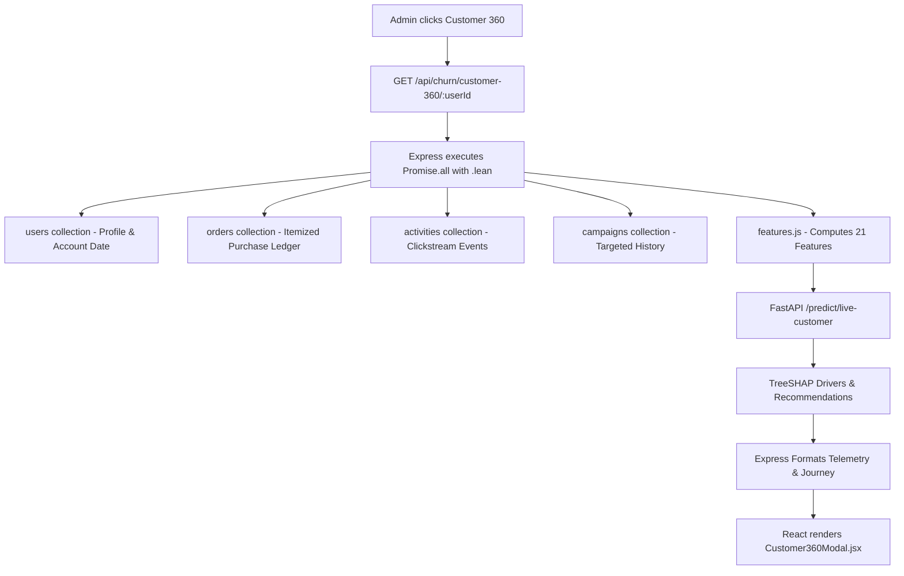
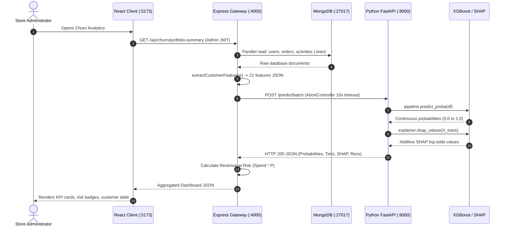

# LumaWear + ChurnIQ
## Complete Project Flow Explanation — Phase 1 to Phase 12

> **Imagine this project as an e-commerce website that watches customer behavior, stores that behavior in a database, converts it into meaningful mathematical signals, sends those signals to a Machine Learning model, receives a churn probability, and then displays business-friendly financial and retention insights to a store administrator.**

---

## 1. Project in One Minute

Here is the entire system in one visual pipeline:

```
Customer Interaction (Browsing / Cart / Wishlist / Purchases)
                     │
                     ▼
          LumaWear React Storefront (:5173)
                     │
                     ▼ [HTTP POST /api/activity or /api/orders]
          Node.js / Express Backend Gateway (:4000)
                     │
                     ▼ [BSON Storage]
          MongoDB Master Database (:27017)
                     │
                     ▼ [Point-in-Time Calculation via features.js]
          The 21-Feature Customer Representation
                     │
                     ▼ [Internal HTTP POST /predict/batch]
          Python FastAPI Machine Learning Microservice (:8000)
                     │
                     ▼ [predict_proba() on in-memory pipeline]
          Active XGBoost Model Artifact (2b2147fd4057)
                     │
                     ▼ [Continuous probability: 0.0000 to 1.0000]
          Churn Probability & Risk Tier (Low / Medium / High / Very High)
                     │
                     ▼ [TreeSHAP Explainer & Rule Recommender]
          SHAP Local Drivers & Retention Actions
                     │
                     ▼ [HTTP 200 JSON Response]
          Express Analytics Aggregator & Business Impact Engine
                     │
                     ▼ [HTTP 200 JSON Response]
          React Admin Dashboard (:5173)
                     │
                     ▼ [Staging Retention Campaigns & Tracking Delta P]
          Targeted Retention Campaigns & Longitudinal Risk Movement
```

### Explanation of Every Box:
1. **Customer**: A human shopper browsing clothing on the LumaWear website.
2. **LumaWear Website (React)**: The storefront interface where items are displayed, added to cart, and purchased.
3. **Customer Actions**: Discrete events emitted by the frontend (viewing a shirt, adding to cart, logging in).
4. **Node.js / Express Backend**: The API gateway and coordinator that manages security, authentication, orders, and data routing.
5. **MongoDB**: The master database storing raw records across accounts (`users`), transactions (`orders`), and clickstream events (`activities`).
6. **Feature Extraction (`features.js`)**: An in-memory JavaScript algorithm that reads raw database history and calculates **21 specific mathematical measurements** bounded by a cutoff date.
7. **21 Customer Features**: The standardized numerical/categorical vector describing customer engagement, purchasing, and profile habits.
8. **FastAPI ML Service**: A high-speed Python web service hosting the pre-trained Machine Learning model.
9. **XGBoost Churn Model (`2b2147fd4057`)**: The decision-making tree ensemble that calculates how likely the customer is to stop purchasing over the next 90 days.
10. **Churn Probability**: A continuous score from `0.0` (0% risk) to `1.0` (100% risk).
11. **Risk Tier**: Four operational action buckets (`Low`, `Medium`, `High`, `Very High`) derived from probability thresholds.
12. **SHAP Explanation**: The diagnostic engine explaining *why* the customer received that score.
13. **Admin Dashboard**: The executive control room where store managers view risk, revenue at risk, customer dossiers, and launch retention plays.
14. **Business Actions**: Targeted retention campaigns staged to win back at-risk shoppers.

---

## 2. High-Level Design (HLD)

### System Architecture Diagram

```mermaid
flowchart TD
    subgraph ClientLayer [Client Layer - Browser]
        Customer[Customer Browser]
        Admin[Store Administrator]
        StorefrontUI[React Storefront :5173]
        AdminDashboardUI[React Admin Dashboard :5173]
    end

    subgraph GatewayLayer [API Gateway & Business Logic - Node.js :4000]
        ExpressApp[Express Web Server / server.js]
        AuthModule[JWT Auth & RBAC Security]
        ActivityIngest[Real-Time Activity Ingestion API]
        FeatureEngine[Point-in-Time Feature Extractor / features.js]
        BusinessImpactEngine[Revenue at Risk & Financial Engine]
        RetentionEngine[7 Retention Action Clusters]
        HealthEngine[3-Tier Latency & PSI Drift Probes]
    end

    subgraph DataLayer [Data Persistence Layer - MongoDB :27017]
        MongoUsers[(users Collection)]
        MongoOrders[(orders Collection)]
        MongoActivities[(activities Collection)]
        MongoCampaigns[(campaigns Collection)]
        MongoSnapshots[(churn_prediction_snapshots Collection)]
        DemoDataStore[demoData.js - In-Memory 12 Personas]
    end

    subgraph MLLayer [Machine Learning Inference Microservice - Python :8000]
        FastAPIRouter[FastAPI ASGI Router / main.py]
        PredictorModule[Predictor & Pipeline / predictor.py]
        XGBoostModel[Active XGBoost Classifier 2b2147fd4057]
        TreeSHAPExplainer[TreeSHAP Explainer shap_explainer.joblib]
        RuleRecommender[Action Recommender / recommender.py]
    end

    Customer --> StorefrontUI
    Admin --> AdminDashboardUI

    StorefrontUI -->|HTTP POST /api/activity, /api/orders| ExpressApp
    AdminDashboardUI -->|HTTP GET /api/churn/* with Admin JWT| ExpressApp

    ExpressApp --> AuthModule
    ExpressApp --> ActivityIngest
    ActivityIngest -->|BSON Write| MongoActivities
    ExpressApp -->|BSON Write| MongoOrders
    ExpressApp -->|BSON Read-Only .lean| MongoUsers
    ExpressApp -->|BSON Read-Only .lean| MongoOrders
    ExpressApp -->|BSON Read-Only .lean| MongoActivities

    ExpressApp --> FeatureEngine
    FeatureEngine -->|21 Raw Features JSON| ExpressApp

    ExpressApp -->|HTTP POST /predict/batch on Port 8000| FastAPIRouter
    FastAPIRouter --> PredictorModule
    PredictorModule --> XGBoostModel
    PredictorModule --> TreeSHAPExplainer
    PredictorModule --> RuleRecommender

    PredictorModule -->|Probabilities + Tiers + SHAP| FastAPIRouter
    FastAPIRouter -->|HTTP 200 JSON Response| ExpressApp

    ExpressApp --> BusinessImpactEngine
    ExpressApp --> RetentionEngine
    ExpressApp --> HealthEngine
    ExpressApp -->|Write Campaign & Snapshot| MongoCampaigns
    ExpressApp -->|Write Baseline P Snapshot| MongoSnapshots

    ExpressApp -->|Aggregated Analytics JSON| AdminDashboardUI
```



---

### Why Each Technology Exists

#### 1. Frontend: React + Vite
- **Technical Term**: Single-Page Application (SPA)
- **Simple Meaning**: A website that updates instantly when you click buttons without refreshing the entire browser page.
- **Why We Use It**: Shoppers get a smooth shopping experience (instant cart drawer, live search), and admins can switch between 7 complex analytics dashboards with zero flicker.

#### 2. Backend: Node.js + Express
- **Technical Term**: API Gateway & Transaction Coordinator
- **Simple Meaning**: The general manager of the website that handles traffic, enforces security, and organizes data.
- **Why We Use It**: Node's non-blocking event loop handles thousands of simultaneous shopping clicks, manages JWT authentication cookies, and orchestrates database queries efficiently.

#### 3. Database: MongoDB
- **Technical Term**: Document-Oriented NoSQL Database
- **Simple Meaning**: A digital filing cabinet that stores data in flexible folders (documents) that look like JSON.
- **Why We Use It**: E-commerce transactions contain nested data (e.g. an order containing 4 different shirts with individual sizes and prices) and activity logs have variable metadata.

#### 4. ML Framework: Python + FastAPI
- **Technical Term**: Asynchronous Machine Learning Microservice
- **Simple Meaning**: A dedicated, ultra-fast Python calculator that accepts customer numbers and returns risk predictions.
- **Why We Use It**: Python has the best ML libraries (Scikit-Learn, XGBoost, SHAP). FastAPI provides C-like speed, automatic data validation, and sub-millisecond execution.

#### 5. ML Model: XGBoost (`2b2147fd4057`)
- **Technical Term**: Gradient Boosted Decision Tree Ensemble
- **Simple Meaning**: A team of 300 smart decision trees that vote together to estimate churn risk.
- **Why We Use It**: Decision tree ensembles significantly outperform neural networks on tabular e-commerce data, naturally handle missing values, and support instant TreeSHAP calculations.

#### 6. Explainability: TreeSHAP
- **Technical Term**: Local Feature Attribution Engine
- **Simple Meaning**: A diagnostic assistant that explains *why* the AI made a prediction by showing which customer habits increased or decreased the risk score.
- **Why We Use It**: Store managers will not trust a black-box AI percentage unless they can see the underlying reasons (e.g. *"Customer hasn't logged in for 45 days"*).

#### 7. Architecture: Microservice Separation (Node $\leftrightarrow$ Python via REST)
- **Technical Term**: Decoupled Microservice Topology
- **Simple Meaning**: Keeping the web store and the AI brain in separate programs connected over a local network cable (HTTP API).
- **Why We Use It**: 
  1. *Ecosystem Fit*: Node runs fast web traffic; Python runs fast matrix math.
  2. *Crash Protection*: If the Python ML service restarts, customer checkouts on Node keep running smoothly.
  3. *Independent Scaling*: In high-traffic seasons, ML inference servers can be scaled on GPU/CPU clusters independently of web storefronts.

---

## 3. Low-Level Design (LLD): Component Directory

```
+----------------------------------------------------------------------------------------------------+
|                                    16 CORE PROJECT COMPONENTS                                      |
|                                                                                                    |
|  [STOREFRONT & AUTH]        [BACKEND GATEWAY & CHURN]             [PYTHON ML SERVICE]              |
|  1. StoreContext.jsx        3. server.js                          7. main.py                       |
|  2. AuthContext.jsx         4. features.js                        8. predictor.py                  |
|                             5. dataset.js                         9. feature_service.py            |
|  [ADMIN DASHBOARDS]         6. extractSingleCustomer.js          10. recommender.py                |
|  11. AdminDashboardPage.jsx                                                                        |
|  12. BusinessImpactView.jsx                                                                        |
|  13. Customer360Modal.jsx                                                                          |
|  14. ModelHealthDashboard.jsx                                                                      |
|  15. CampaignEffectivenessDashboard.jsx                                                            |
|  16. RetentionActionCenter.jsx                                                                     |
+----------------------------------------------------------------------------------------------------+
```

### Detailed Component Deep-Dive

#### 1. `StoreContext.jsx` (Frontend Store State)
- **Purpose**: Manages shopping cart, wishlist items, product catalog, and recent views.
- **Input**: User clicks on products, add-to-cart buttons, wishlist toggles.
- **Processing**: Updates local state, persists cart to `localStorage`, and triggers `AuthContext.logActivity()`.
- **Output**: React state provider wrapping all storefront pages.
- **Who Calls It**: Storefront UI pages (`ShopPage.jsx`, `ProductDetailsPage.jsx`, `CartPage.jsx`).
- **What It Calls**: `AuthContext.jsx:logActivity()`.

#### 2. `AuthContext.jsx` (Frontend Auth & Network Emitter)
- **Purpose**: Manages user authentication tokens and dispatches real-time clickstream events.
- **Input**: Login credentials; event payloads from storefront components.
- **Processing**: Stores JWT tokens in memory/storage, handles automatic session refresh on 401 errors, and executes `POST /api/activity`.
- **Output**: React auth state, `signIn()`, `signOut()`, and `logActivity()`.
- **Who Calls It**: `Navbar.jsx`, `SignInPage.jsx`, `StoreContext.jsx`.
- **What It Calls**: Express API endpoints (`/api/auth/*`, `/api/activity`).

#### 3. `server.js` (Express Gateway & Orchestrator)
- **Purpose**: Primary backend application. Handles authentication, transactional orders, MongoDB queries, feature extraction execution, FastAPI communication, and business impact math.
- **Input**: HTTP requests from React client.
- **Processing**: 
  - Verifies JWT access/refresh tokens.
  - Queries MongoDB `User`, `Order`, `Activity` collections using `.lean()`.
  - Executes `extractCustomerFeatures()` in memory.
  - Dispatches `POST http://127.0.0.1:8000/predict/batch` with an `AbortController` 10-second timeout.
  - Computes Revenue at Risk ($\text{Spend} \times P(\text{churn})$), matches retention action clusters, and records snapshots.
- **Output**: Standardized JSON responses to the frontend.
- **Who Calls It**: React frontend.
- **What It Calls**: MongoDB (Mongoose), `features.js`, FastAPI on port 8000, `demoData.js`.

#### 4. `features.js` (Point-in-Time Feature Extractor)
- **Purpose**: Implements the canonical 21-feature contract with zero temporal data leakage.
- **Input**: `{ user, activities, orders, asOfDate }`.
- **Processing**: Filters events with `createdAt <= asOfDate`, computes 30-day sliding sums, recencies, purchase counts, lifetime spend, order frequency, and preferred category.
- **Output**: Plain JavaScript object containing exactly the 21 features.
- **Who Calls It**: `server.js`, `dataset.js`, `extractSingleCustomer.js`.
- **What It Calls**: Native JavaScript Date, Map, and Set math.

#### 5. `dataset.js` (Dataset Generator & Validator)
- **Purpose**: Generates historical training datasets across historical snapshot dates.
- **Input**: Raw collections of `users`, `orders`, `activities`, and historical `asOfDates`.
- **Processing**: Iterates through historical timestamps, extracts point-in-time features, calculates ground-truth 90-day future churn labels, and validates against negative numbers or missing columns.
- **Output**: Validated training dataset rows.
- **Who Calls It**: Offline dataset export scripts (`exportDataset.js`).
- **What It Calls**: `features.js`.

#### 6. `extractSingleCustomer.js` (Direct Node.js CLI Extractor)
- **Purpose**: Standalone CLI script allowing external services to extract 21 features for a single customer directly from MongoDB.
- **Input**: Command-line argument `userId`.
- **Processing**: Connects to MongoDB, queries documents, and runs `extractCustomerFeatures()`.
- **Output**: Prints JSON `{ success: true, user_id, features }` to stdout.
- **Who Calls It**: Python fallback service `feature_service.py`.
- **What It Calls**: Mongoose, `features.js`.

#### 7. `main.py` (FastAPI Microservice Router)
- **Purpose**: ASGI routing application for the ChurnIQ inference service.
- **Input**: HTTP requests on port 8000.
- **Processing**: Validates incoming feature vectors against Pydantic schemas, routes requests to `predictor.py`, and exposes `/health`, `/predict/batch`, and `/predict/live-customer`.
- **Output**: Pydantic validated prediction JSON responses.
- **Who Calls It**: Express backend `server.js`.
- **What It Calls**: `predictor.py`, `feature_service.py`.

#### 8. `predictor.py` (ML Inference & Explainability Engine)
- **Purpose**: Manages in-memory model artifact caching, preprocessing, XGBoost scoring, TreeSHAP explainability, and risk tier categorization.
- **Input**: Feature dictionaries.
- **Processing**: Loads artifacts once into global cache `_cache`, executes Scikit-Learn `Pipeline.predict_proba()`, transforms features for `TreeExplainer.shap_values()`, maps continuous probabilities to risk tiers, and calls `generate_recommendations()`.
- **Output**: Complete prediction dictionary with probabilities, risk tiers, SHAP drivers, and priority recommendations.
- **Who Calls It**: `main.py`.
- **What It Calls**: Scikit-Learn Pipeline, XGBoost, SHAP TreeExplainer, `recommender.py`.

#### 9. `feature_service.py` (Python-Side Feature Bridge)
- **Purpose**: Provides Python endpoints with direct access to live customer features from MongoDB without duplicating extraction code.
- **Input**: `user_id` string.
- **Processing**: Calls Express `/api/churn/customer-features/:userId`; falls back to running `extractSingleCustomer.js` via a Node subprocess.
- **Output**: Dictionary of 21 raw features.
- **Who Calls It**: `main.py:predict_live_customer()`.
- **What It Calls**: Express API or Node.js CLI subprocess.

#### 10. `recommender.py` (Action Recommendation Engine)
- **Purpose**: Translates statistical SHAP drivers and feature values into human-readable retention plays.
- **Input**: `top_shap_features`, `customer_data`, `churn_probability`.
- **Processing**: Matches feature thresholds and SHAP directions to prioritize actionable business recommendations.
- **Output**: List of recommendation objects (`driven_by`, `shap_impact`, `recommendation`, `priority`).
- **Who Calls It**: `predictor.py`.

#### 11. `AdminDashboardPage.jsx` (Admin Control Center)
- **Purpose**: Primary React admin page managing tab navigation, search, filters, pagination, and data loading.
- **Input**: Data from `GET /api/churn/portfolio-summary`.
- **Processing**: Manages active tab state (`analytics`, `business_impact`, `retention`, `campaigns`, `store_data`, `model_health`, `effectiveness`), Demo Mode toggles, search filtering, and modal launches.
- **Output**: Top-level dashboard view and child components.
- **Who Calls It**: React Router in `App.jsx`.
- **What It Calls**: Child components (12 through 16).

#### 12. `BusinessImpactView.jsx` (Revenue at Risk View)
- **Purpose**: Renders financial exposure and Revenue at Risk visualizations.
- **Input**: Data from `GET /api/churn/business-impact`.
- **Processing**: Formats currency metrics, renders 4-tier exposure tables, and displays top value-at-risk customer cards.
- **Output**: Financial impact dashboard.
- **Who Calls It**: `AdminDashboardPage.jsx`.

#### 13. `Customer360Modal.jsx` (Customer Dossier Modal)
- **Purpose**: Full modal dossier displaying complete customer history, 21-feature telemetry, and journey.
- **Input**: Data from `GET /api/churn/customer-360/:userId`.
- **Processing**: Renders customer profile, 90-day risk cards, SHAP driver bars, 5 chronological journey milestones, 21-feature telemetry grid (Engagement, Purchasing, Profile), and order history.
- **Output**: Interactive modal.
- **Who Calls It**: `AdminDashboardPage.jsx`.

#### 14. `ModelHealthDashboard.jsx` (MLOps & Drift Monitor)
- **Purpose**: System health, infrastructure latency, and data drift monitor.
- **Input**: Data from `GET /api/churn/model-health`.
- **Processing**: Renders Express/MongoDB/FastAPI latency cards, model artifact verification badges, 21-feature quality metrics, PSI drift table with warning indicators, and prediction distribution histograms.
- **Output**: Operational MLOps dashboard.
- **Who Calls It**: `AdminDashboardPage.jsx`.

#### 15. `CampaignEffectivenessDashboard.jsx` (Longitudinal Tracking & ROI Simulator)
- **Purpose**: Tracks before-vs-after risk reduction and simulates campaign experimentation ROI.
- **Input**: Data from `GET /api/churn/campaign-effectiveness`.
- **Processing**: Renders campaign risk reduction cards ($\Delta P = P_{\text{baseline}} - P_{\text{latest}}$), individual risk transitions (`High → Low`), Experiment Simulator (A/B Holdout Calculator), and Retention ROI Simulator.
- **Output**: Effectiveness and experimentation dashboard.
- **Who Calls It**: `AdminDashboardPage.jsx`.

#### 16. `RetentionActionCenter.jsx` (Actionable Retention Hub)
- **Purpose**: Displays the 7 retention action clusters and allows staging retention campaigns.
- **Input**: Data from `GET /api/churn/retention-opportunities`.
- **Processing**: Renders 7 action cluster cards with recipient counts, priority badges, suggested messages, and launches `CampaignPreviewModal.jsx` to stage campaigns.
- **Output**: Retention action hub.
- **Who Calls It**: `AdminDashboardPage.jsx`.

---

## 4. Complete End-to-End Customer Flow

Here is the exact step-by-step technical lifecycle of a customer named **Rahul**:

```
Step 1: Registration & Initial Visit
  Rahul opens LumaWear -> Registers account -> Node creates document in `users`
  (tenure_days = 0).

Step 2: Browsing Behavior
  Rahul browses 6 Jacket items -> Storefront emits `POST /api/activity`
  -> 6 `product_viewed` documents created in MongoDB `activities`.

Step 3: Cart & Wishlist Interaction
  Rahul saves a Winter Parka to wishlist (`wishlist_toggle`) and adds it to cart (`cart_add`).
  2 activity documents logged in `activities`.

Step 4: First Order Checkout
  Rahul checks out order LW-1092 ($240.00) -> `POST /api/orders`
  -> Document created in `orders` (`status: "confirmed"`); `order_placed` logged in `activities`.

Step 5: Disengagement Period (45 Days Later)
  Rahul leaves the site and does not return for 45 days.
  tenure_days = 45, days_since_last_login = 45, days_since_last_activity = 45,
  days_since_last_order = 45, activity_event_count_30d = 0.

Step 6: Admin Triggers Portfolio Analytics
  Admin opens Admin Dashboard -> React calls `GET /api/churn/portfolio-summary`.

Step 7: Node.js Parallel Database Ingestion
  Express verifies admin JWT -> Queries `User`, `Order`, `Activity` via `Promise.all()`
  using read-only `.lean()`.

Step 8: In-Memory 21-Feature Extraction
  server.js passes Rahul's records into `extractCustomerFeatures()` in `features.js`.
  Calculates exact 21 point-in-time features bounded by `asOfDate`.

Step 9: Node.js Calls FastAPI Over HTTP REST
  Express dispatches: `POST http://127.0.0.1:8000/predict/batch`
  Body: `{ customers: [ { 21 features } ] }`.

Step 10: FastAPI Preprocessing & XGBoost Scoring
  FastAPI preprocessor scales numbers and One-Hot Encodes category (expanding 21 to 29 columns).
  `XGBClassifier.predict_proba()` produces continuous probability: P = 0.8142 (81.42%).
  `_risk_level(0.8142)` categorizes as "Very High Risk".

Step 11: TreeSHAP Attribution & Recommendations
  `shap_explainer.joblib` decomposes score:
  - days_since_last_activity (45d) -> SHAP: +0.52 (increases churn)
  - activity_event_count_30d (0 events) -> SHAP: +0.41 (increases churn)
  - total_spend ($240) -> SHAP: -0.18 (reduces churn)
  Recommender generates: "Inactivity Re-engagement Campaign with comeback perk."

Step 12: Express Returns Dashboard Payload
  FastAPI returns JSON -> Express calculates Revenue at Risk ($240 * 0.8142 = $195.41)
  and responds to React. Dashboard displays Rahul with red "Very High Risk (81.4%)" badge.
```

---

## 5. What Exactly is Churn?

### Simple Definition
In our e-commerce project, **Churn** means:
> *"A customer who previously bought items from LumaWear stops visiting and places ZERO orders over the next 90 days."*

### Understanding the Probability $P(\text{churn})$
- **Probability ($P$)** is a continuous number between `0.0000` (0% chance) and `1.0000` (100% chance).
- **Percentage**: $P \times 100\%$ (e.g. $0.7824 \rightarrow 78.24\%$).
- **Statistical Meaning**: If the model gives $P = 0.78$, it means: *Based on historical patterns of thousands of similar shoppers, 78 out of 100 will churn in the next 90 days if no retention action is taken.*
- **Important Distinction**: The model is NOT making a 100% certainty guarantee. The customer still has a 22% probability of returning organically.

---

## 6. How the Model Decides Risk (The 4 Tiers)

The continuous probability is mapped into 4 operational risk tiers defined in [`predictor.py`](file:///c:/Users/vinus/OneDrive/Desktop/Majorproject/ChurnProject/backend/predictor.py#L64-L80) and [`server.js`](file:///c:/Users/vinus/OneDrive/Desktop/Majorproject/LumaWear-Ecommerce/backend/src/server.js#L834-L839):

$$\text{Risk Tier} = \begin{cases} \text{Low Risk} & \text{if } P < 0.25 \\ \text{Medium Risk} & \text{if } 0.25 \le P < 0.50 \\ \text{High Risk} & \text{if } 0.50 \le P < 0.75 \\ \text{Very High Risk} & \text{if } P \ge 0.75 \end{cases}$$

### Operational Action Rules:
- **Low Risk ($P < 0.25$, e.g. $0.15$)**: Loyal, active shopper. Do not disturb; send standard newsletters.
- **Medium Risk ($0.25 \le P < 0.50$, e.g. $0.38$)**: Moderate engagement drop. Send gentle product recommendations.
- **High Risk ($0.50 \le P < 0.75$, e.g. $0.64$)**: At-risk customer. Trigger high-priority retention campaign (15% discount code).
- **Very High Risk ($P \ge 0.75$, e.g. $0.82$)**: Critical attrition danger. Immediate VIP concierge outreach or aggressive win-back perk.

---

## 7. What Factors Affect Churn? Feature Importance & SHAP

### Global Feature Importance vs. Local SHAP

```
+----------------------------------------------------------------------------------------------------+
|                       GLOBAL FEATURE IMPORTANCE vs. LOCAL SHAP EXPLANATION                         |
|                                                                                                    |
|  Global Feature Importance (Across Entire Model)    Local SHAP Values (For One Individual Shopper) |
|  - What it is: Dataset-level average impact.        - What it is: Exact tug-of-war on ONE score.   |
|  - #1: activity_event_count_30d (0.6102)            - Example: Rahul's 45-day inactivity added     |
|  - #2: days_since_last_login (0.2844)                 +0.52 to his risk, while his $240 spend      |
|  - #3: average_order_value (0.2158)                   subtracted -0.18 from his risk.              |
+----------------------------------------------------------------------------------------------------+
```

### The 21 Canonical Features Table

| # | Feature Name | Category | Raw Source | Formula / Logic | Why It Indicates Churn | Example |
| :--- | :--- | :--- | :--- | :--- | :--- | :--- |
| 1 | `activity_event_count_30d` | Engagement | `activities` | Count of meaningful events in past 30d | **#1 Top Feature (0.6102)**. Activity collapse is strongest churn signal. | `24.0` |
| 2 | `days_since_last_login` | Engagement | `activities` | $\lfloor(\text{asOfDate} - \text{login date}) / 86.4\text{M}\rfloor$ | **#2 Top Feature (0.2844)**. Measures deliberate sign-in recency. | `14.0` |
| 3 | `days_since_last_activity` | Engagement | `activities` | $\lfloor(\text{asOfDate} - \text{activity date}) / 86.4\text{M}\rfloor$ | Measures passive storefront presence and click recency. | `8.0` |
| 4 | `login_count_30d` | Engagement | `activities` | Count of `auth_login` in past 30d | Distinguishes daily habitual shoppers from rare visitors. | `4.0` |
| 5 | `active_days_30d` | Engagement | `activities` | Unique calendar days (`YYYY-MM-DD`) visited in 30d | Distinguishes regular habits from one-time burst visits. | `5.0` |
| 6 | `page_views_30d` | Engagement | `activities` | Count of `page_view` in past 30d | General browsing volume across the storefront. | `18.0` |
| 7 | `product_views_30d` | Engagement | `activities` | Count of `product_viewed` in past 30d | Specific catalog item evaluation and purchase intent. | `12.0` |
| 8 | `distinct_products_viewed_30d` | Engagement | `activities` | Unique `productId` count viewed in 30d | Breadth of catalog exploration. | `7.0` |
| 9 | `cart_actions_30d` | Engagement | `activities` | Count of cart additions/updates/removals in 30d | Bottom-funnel intent. Cart actions with 0 orders = abandonment. | `2.0` |
| 10 | `wishlist_actions_30d` | Engagement | `activities` | Count of `wishlist_toggle` in past 30d | Aspirational interest and price-monitoring behavior. | `1.0` |
| 11 | `order_count` | Purchasing | `orders` | Total lifetime successful orders (`confirmed`/`completed`)| Repeat buyers have significantly higher retention baselines. | `3.0` |
| 12 | `orders_30d` | Purchasing | `orders` | Completed orders in past 30d | Recent purchasing momentum (recent buyers rarely churn). | `1.0` |
| 13 | `days_since_last_order` | Purchasing | `orders` | $\lfloor(\text{asOfDate} - \text{order date}) / 86.4\text{M}\rfloor$ | Purchase recency gap. | `28.0` |
| 14 | `total_spend` | Purchasing | `orders` | $\sum \text{order.total}$ across all orders | Lifetime customer monetary value (LTV). | `580.40` |
| 15 | `spend_30d` | Purchasing | `orders` | $\sum \text{order.total}$ in past 30d | Financial velocity over recent cycle. | `120.00` |
| 16 | `average_order_value` (AOV) | Purchasing | `orders` | $\text{total\_spend} / \text{order\_count}$ | **#3 Top Feature (0.2158)**. Luxury vs. budget buying dynamics. | `193.47` |
| 17 | `order_frequency` | Purchasing | `orders`/`users` | $\text{order\_count} / \max(\text{tenure\_days}/30, 1.0)$ | Normalized purchasing cadence per 30-day month. | `0.65` |
| 18 | `distinct_categories_ordered` | Purchasing | `orders` | Unique `category` count purchased | Multi-category buyers have higher brand stickiness. | `2.0` |
| 19 | `items_per_order` | Purchasing | `orders` | Total item quantities sum / `order_count` | Basket depth indicator. | `1.8` |
| 20 | `tenure_days` | Profile | `users` | $\lfloor(\text{asOfDate} - \text{user.createdAt}) / 86.4\text{M}\rfloor$ | Account age; new users have higher early hazard drop-off. | `140.0` |
| 21 | `preferred_order_category` | Profile | `orders` | Most ordered clothing category | Encoded to 8 binary columns for category retention plays. | `"Jackets"` |

---

## 8. How the Admin Dashboard Works

```
[React Browser UI :5173]
          │
          │ HTTP GET (Admin Access Token)
          ▼
[Express Backend Gateway :4000]
          │
          ├─► 1. Queries MongoDB (users, orders, activities)
          ├─► 2. Runs features.js extractCustomerFeatures()
          ├─► 3. Calls FastAPI http://127.0.0.1:8000/predict/batch
          ├─► 4. Receives Probabilities + SHAP Drivers
          ├─► 5. Calculates Revenue at Risk (Spend * P)
          ├─► 6. Matches 7 Retention Action Clusters
          │
          │ HTTP JSON Response
          ▼
[React UI Renders 7 Dashboard Tabs]
```

### The 7 Core Dashboards:
1. **Churn Risk Analytics** (`GET /api/churn/portfolio-summary`): Overview KPI cards, 4 risk distribution cards, global drivers chart, filterable customer table.
2. **Business Impact** (`GET /api/churn/business-impact`): Total Customer Value, Estimated Revenue at Risk ($ and %), High-Risk Revenue Exposed, tier financial breakdown table.
3. **Retention Action Center** (`GET /api/churn/retention-opportunities`): 7 action cluster cards with recipient counts, priority badges, suggested messages.
4. **Campaign History** (`GET /api/churn/campaigns`): Staged campaign cards with status badges (`PLANNED`, `SENT`, `COMPLETED`, `CANCELLED`).
5. **Customer 360** (`GET /api/churn/customer-360/:userId`): Full dossier with profile, 90-day risk, SHAP drivers, 5 journey milestones, 21-feature telemetry grid, and order ledger.
6. **Model Health & MLOps** (`GET /api/churn/model-health`): Express/MongoDB/FastAPI latency cards, model artifact verification, PSI data drift table, prediction distribution histogram.
7. **Retention Effectiveness** (`GET /api/churn/campaign-effectiveness`): Before-vs-after risk reduction ($\Delta P = P_{\text{baseline}} - P_{\text{latest}}$), A/B holdout experiment calculator, ROI simulator.

---

## 9. Business Impact: How Revenue at Risk is Calculated

```
For Each Customer i:
   Historical Spend (i) = Sum of all successful completed orders ($)
   Predicted Churn Probability P(i) = XGBoost model output (0.0000 to 1.0000)
   Customer Revenue at Risk (i) = Historical Spend (i) × P(i)

Portfolio Aggregations:
   Total Customer Value = Σ Historical Spend (i)
   Estimated Revenue at Risk = Σ [ Historical Spend (i) × P(i) ]
   Revenue at Risk Percentage = (Estimated Revenue at Risk / Total Customer Value) × 100%
   High-Risk Revenue Exposed = Σ Historical Spend (i) for all customers with Risk Level ∈ {High, Very High}
   High-Risk Revenue at Risk = Σ Revenue at Risk (i) for all customers with Risk Level ∈ {High, Very High}
```

### Concrete Financial Example
- **Customer A (VIP Shopper)**: Spent **₹10,000** lifetime. Model predicts **$P(\text{churn}) = 0.70$ (70%)**.
  $$\text{Revenue at Risk} = 10,000 \times 0.70 = \text{₹7,000}$$
- **Important Disclaimer**: This is an **exposure metric**, not guaranteed lost cash flow tomorrow. It allows store managers to prioritize retention outreach based on financial value.

---

## 10. Customer 360: Assembling the Full Dossier

When an admin clicks **"Customer 360"** on any customer row, Express executes a parallel database read across 4 collections:



### The 3 Telemetry Categories in Customer 360:
1. **Engagement Telemetry (10 features)**: Activity counts, login recencies, page views, product views, cart actions, wishlist actions.
2. **Purchasing Telemetry (9 features)**: Order counts, spend, AOV, order frequency, days since order, items per order.
3. **Profile Telemetry (2 features)**: Tenure days, preferred clothing category.

---

## 11. Model Health & MLOps Drift Monitoring (Phase 11)

```
+----------------------------------------------------------------------------------------------------+
|                                    MODEL HEALTH MONITORING                                         |
|                                                                                                    |
|  1. Infrastructure Latency Probes                                                                  |
|     - Express REST Gateway: ~1ms                                                                   |
|     - MongoDB Database (admin.ping): ~4ms                                                          |
|     - FastAPI Inference Engine (HEAD /docs): ~12ms                                                 |
|                                                                                                    |
|  2. Model Artifact Integrity Verification                                                          |
|     - Model Hash: 2b2147fd4057 (XGBoost Classifier + TreeSHAP)                                     |
|     - Training Dataset: 7,912 point-in-time snapshots                                              |
|     - 5-Fold Cross-Validation ROC-AUC: 0.8370 ± 0.0108 (Training AUC: 0.9736)                      |
|                                                                                                    |
|  3. Population Stability Index (PSI) Data Drift Monitoring                                         |
|     - Compares live feature distributions against 7,912 training baselines.                        |
|     - PSI < 0.10: Stable Distribution (Optimal)                                                    |
|     - 0.10 <= PSI < 0.25: Moderate Shift (Warning)                                                 |
|     - PSI >= 0.25: Significant Drift Detected (Action Needed)                                      |
+----------------------------------------------------------------------------------------------------+
```

### Why Data Drift Does Not Mean the Model is Broken
Data drift indicates that customer input behavior $P(X)$ has changed over time (e.g., during a holiday shopping surge). It does not prove the model's predictive rules $P(Y|X)$ have degraded. Drift acts as an early warning for engineers to audit data quality.

---

## 12. Retention Effectiveness & Risk Movement (Phase 12)

```
Step 1: Campaign Creation (Baseline Capture)
   Admin stages campaign -> Baseline snapshot stored in `churn_prediction_snapshots`:
   { userId: "u-101", campaignId: "CAMP-901", churnProbability: 0.82 (Baseline) }

Step 2: Customer Returns & Purchases
   Customer receives campaign email, logs in, and places an order.

Step 3: Real-Time Rescoring
   Admin opens Effectiveness Dashboard -> Customer rescored live:
   Current Live Probability = 0.42 (Latest)

Step 4: Longitudinal Risk Movement Calculation
   ΔP = P_baseline - P_latest = 0.82 - 0.42 = +0.40 (+40% Risk Reduction)
   UI displays transition badge: "Very High Risk -> Medium Risk"
```

### Observational vs. Causal Evidence
- **Observational Evidence**: The model's predicted risk dropped from 82% to 42%.
- **Causal Proof**: Requires randomized A/B holdout testing to prove that the email caused the purchase and the customer didn't just return organically.

---

## 13. API Integration: How MERN Connects to Python



---

## 14. Database Collections & Architecture

```
+----------------------------------------------------------------------------------------------------+
|                                    MONGODB DATABASE ARCHITECTURE                                   |
|                                                                                                    |
|  [READ-ONLY ANALYTICAL COLLECTIONS] (Operational State - Untouched by Analytics)                   |
|  ├── users: {_id, name, email, salt, passwordHash, role, createdAt, lastLoginAt}                   |
|  ├── orders: {_id, userId, orderNumber, items: [{productId, productName, category, quantity, ...}],|
|  │            subtotal, shipping, discount, total, status, createdAt}                              |
|  └── activities: {_id, userId, type, route, metadata: {productId, ...}, userAgent, createdAt}     |
|                                                                                                    |
|  [ANALYTICAL & CAMPAIGN WRITE COLLECTIONS] (Isolated Analytics State)                              |
|  ├── campaigns: {_id, campaignId, name, campaignType, priority, targetCustomerIds: [...],          |
|  │               targetCustomers: [{userId, name, email, churnProbability, riskLevel, ...}],       |
|  │               customerCount, suggestedMessage, status: "PLANNED"|"SENT"|"COMPLETED", createdBy} |
|  └── churn_prediction_snapshots: {_id, userId, campaignId, churnProbability, riskLevel, modelId,   |
|                                  topDriver, capturedAt}                                            |
|                                                                                                    |
|  [IN-MEMORY SYNTHETIC DEMO LAYER] (Zero Database Writes)                                          |
|  └── demoData.js: 12 Calibrated Demo Personas (DEMO-LOW-*, DEMO-MED-*, DEMO-HIGH-*, DEMO-VHIGH-*)  |
+----------------------------------------------------------------------------------------------------+
```

---

## 15. The Phase 1 $\rightarrow$ Phase 12 Evolution Story

| Phase | What Was Built | Why It Was Needed | Simple 1-2 Sentence Summary |
| :--- | :--- | :--- | :--- |
| **Phase 1** | Storefront & Core E-Commerce | Real transaction & shopping foundation. | Built React store, Express backend, JWT auth, and cart checkout. |
| **Phase 2** | Real-Time Activity Telemetry | Capture behavioral streams for ML signals. | Built `POST /api/activity` to record clicks, page views, and cart actions into MongoDB. |
| **Phase 3** | 21-Feature Engineering Contract | Eliminate data leakage & create canonical feature contract. | Built `features.js` to extract 21 point-in-time features strictly bounded by `asOfDate`. |
| **Phase 4** | XGBoost Model Training & Validation | Train predictive classifier on historical snapshots. | Trained XGBoost on 7,912 snapshots, achieving a 5-fold CV ROC-AUC of 0.837. |
| **Phase 5** | TreeSHAP Explainability Integration | Explain individual local churn drivers. | Integrated `shap.TreeExplainer` to compute exact additive feature contributions. |
| **Phase 6** | FastAPI Inference Microservice | Dedicated low-latency scoring service. | Built Python FastAPI service exposing `/predict/batch` and `/predict/live-customer`. |
| **Phase 7** | Express $\leftrightarrow$ FastAPI Gateway Proxy | Connect MERN stack to Python microservice. | Connected Express to FastAPI over HTTP REST with `AbortController` timeout protection. |
| **Phase 8** | Portfolio Churn Analytics Dashboard | Executive overview of customer base risk. | Built React dashboard with 4 risk tiers, KPI cards, top drivers, and customer table. |
| **Phase 9** | Retention Action Center | Turn risk predictions into actionable marketing plays. | Built 7 rule-based action clusters, campaign staging, and campaign state machines. |
| **Phase 10** | Business Impact & Customer 360 | Quantify financial risk and provide full customer dossiers. | Added Revenue at Risk math ($\text{Spend} \times P$) and multi-section Customer 360 modal. |
| **Phase 11** | Model Health & MLOps Monitoring | Monitor latency, data quality, and PSI data drift. | Built latency probes, feature completeness audits, and Population Stability Index drift tracking. |
| **Phase 12** | Retention Effectiveness & Experimentation | Track before-vs-after risk reduction & model ROI. | Built longitudinal risk movement tracking ($\Delta P$), baseline snapshots, and ROI simulator. |

---

## 16. 50 Interview & Viva Questions (Master Format)

### 1. Why did you choose XGBoost over Random Forest or Neural Networks?
- **Simple**: XGBoost is faster, handles missing e-commerce data naturally, and is much better at tabular data than neural networks.
- **Technical**: Gradient Boosted Decision Trees optimize second-order loss functions, handle class imbalance via `scale_pos_weight`, and support polynomial-time TreeSHAP calculations ($O(TLD^2)$).
- **One-Line**: *"XGBoost outperforms neural networks on tabular e-commerce data while enabling sub-10ms TreeSHAP explainability."*
- **Project File**: [`trainer.py:137-154`](file:///c:/Users/vinus/OneDrive/Desktop/Majorproject/ChurnProject/backend/trainer.py#L137-L154).

### 2. Why FastAPI instead of Flask or Django?
- **Simple**: FastAPI is much faster, supports async requests natively, and validates data automatically using Python types.
- **Technical**: FastAPI runs on ASGI (Uvicorn), providing high-concurrency throughput and native Pydantic schema validation.
- **One-Line**: *"FastAPI delivers high-throughput ASGI execution and automatic Pydantic schema validation for ML payloads."*
- **Project File**: [`main.py:50-54`](file:///c:/Users/vinus/OneDrive/Desktop/Majorproject/ChurnProject/backend/main.py#L50-L54).

### 3. Why Node.js + Express for backend instead of doing everything in Python?
- **Simple**: Node handles high-traffic storefront shopping and database requests efficiently, while Python is reserved for heavy ML math.
- **Technical**: Follows microservice separation: Express handles I/O-bound web traffic, JWT authentication, and session management; Python handles C-optimized ML inference.
- **One-Line**: *"Express handles I/O-bound e-commerce transactions, while FastAPI serves as an isolated ML microservice."*
- **Project File**: [`server.js:46-59`](file:///c:/Users/vinus/OneDrive/Desktop/Majorproject/LumaWear-Ecommerce/backend/src/server.js#L46-L59).

### 4. How does Node.js communicate with FastAPI?
- **Simple**: They communicate over an internal local network using standard HTTP REST API calls with JSON data.
- **Technical**: Express uses native `fetch()` to send `POST http://127.0.0.1:8000/predict/batch` wrapped in an `AbortController` timeout.
- **One-Line**: *"Express communicates with FastAPI via internal HTTP REST JSON payloads on port 8000."*
- **Project File**: [`server.js:917-941`](file:///c:/Users/vinus/OneDrive/Desktop/Majorproject/LumaWear-Ecommerce/backend/src/server.js#L917-L941).

### 5. Where is the active ML model stored and how is it loaded?
- **Simple**: It is stored on disk in `artifacts/2b2147fd4057/` as a `.joblib` file and loaded once into memory when the server starts.
- **Technical**: `churn_pipeline.joblib` and `shap_explainer.joblib` are cached in memory in `predictor.py` via `_load_if_needed()`.
- **One-Line**: *"Model artifact 2b2147fd4057 is cached in memory on FastAPI startup for sub-millisecond inference."*
- **Project File**: [`predictor.py:27-38`](file:///c:/Users/vinus/OneDrive/Desktop/Majorproject/ChurnProject/backend/predictor.py#L27-L38).

### 6. Does the model retrain every time a prediction is made?
- **Simple**: No, the model is trained once offline and only makes read-only predictions live.
- **Technical**: Live API requests execute `pipeline.predict_proba()` without updating weights or tree splits.
- **One-Line**: *"No, the model operates strictly in read-only inference mode."*
- **Project File**: [`predictor.py:123-128`](file:///c:/Users/vinus/OneDrive/Desktop/Majorproject/ChurnProject/backend/predictor.py#L123-L128).

### 7. Who calculates the 21 features?
- **Simple**: The Node.js backend calculates them from raw MongoDB records before sending them to Python.
- **Technical**: The pure function `extractCustomerFeatures()` in `features.js` extracts the 21 features in memory.
- **One-Line**: *"Node.js extracts the 21 features from raw MongoDB documents and forwards them as JSON to FastAPI."*
- **Project File**: [`features.js:146-198`](file:///c:/Users/vinus/OneDrive/Desktop/Majorproject/LumaWear-Ecommerce/backend/src/churn/features.js#L146-L198).

### 8. What are the 21 features? What is the most important one?
- **Simple**: 10 engagement metrics, 9 purchasing metrics, and 2 profile metrics. The #1 feature is 30-day activity count.
- **Technical**: 20 numeric and 1 categorical feature; `activity_event_count_30d` has the highest feature importance (`0.6102`).
- **One-Line**: *"21 canonical behavioral features covering engagement, spend, and profile, led by 30-day activity event volume."*
- **Project File**: [`feature_importance.json:1-5`](file:///c:/Users/vinus/OneDrive/Desktop/Majorproject/ChurnProject/artifacts/2b2147fd4057/feature_importance.json#L1-L5).

### 9. Why are there 21 raw features but 29 post-OHE features?
- **Simple**: The single text feature (`preferred_order_category`) is expanded into 8 binary 1/0 columns.
- **Technical**: 20 numeric columns + 8 One-Hot Encoded binary columns = 28 + 1 = 29 transformed dimensions.
- **One-Line**: *"One-Hot Encoding expands the single categorical feature into 8 binary channels."*
- **Project File**: [`feature_order.json:1-31`](file:///c:/Users/vinus/OneDrive/Desktop/Majorproject/ChurnProject/artifacts/2b2147fd4057/feature_order.json#L1-L31).

### 10. What happens if a customer is brand new with 0 orders and 0 activity?
- **Simple**: Missing features default to `null`, and the model's preprocessing pipeline fills them with median values learned during training.
- **Technical**: Pipeline `SimpleImputer(strategy="median")` handles nulls without crashing inference.
- **One-Line**: *"Cold-start nulls are imputed via training medians in the preprocessing pipeline."*
- **Project File**: [`trainer.py:110-118`](file:///c:/Users/vinus/OneDrive/Desktop/Majorproject/ChurnProject/backend/trainer.py#L110-L118).

### 11. What is data leakage and how did you prevent it?
- **Simple**: Data leakage is an AI cheating by seeing future data during training. We prevented it using strict cutoff dates.
- **Technical**: Features enforce `createdAt <= asOfDate`, keeping the subsequent 90 days isolated strictly for ground-truth labeling.
- **One-Line**: *"We eliminated data leakage using strict point-in-time timestamp cutoffs on all feature extractions."*
- **Project File**: [`dataset.js:201-246`](file:///c:/Users/vinus/OneDrive/Desktop/Majorproject/LumaWear-Ecommerce/backend/src/churn/dataset.js#L201-L246).

### 12. What does 78% churn probability mean?
- **Simple**: 78 out of 100 similar historical customers stopped buying over the next 90 days.
- **Technical**: Continuous probability $P(\text{churn}) = 0.78$ output by the model's logistic sigmoid transformation.
- **One-Line**: *"A 78% statistical likelihood of zero completed orders placed over the subsequent 90-day window."*
- **Project File**: [`predictor.py:123-128`](file:///c:/Users/vinus/OneDrive/Desktop/Majorproject/ChurnProject/backend/predictor.py#L123-L128).

### 13. How are risk tiers decided?
- **Simple**: Continuous probabilities are divided into 4 equal bands: Low (<25%), Medium (25-50%), High (50-75%), and Very High (>75%).
- **Technical**: Defined in `_risk_level(prob)` in `predictor.py` and matched in `server.js`.
- **One-Line**: *"Risk tiers are mapped using 25% boundary thresholds across the 0.0 to 1.0 probability space."*
- **Project File**: [`predictor.py:64-80`](file:///c:/Users/vinus/OneDrive/Desktop/Majorproject/ChurnProject/backend/predictor.py#L64-L80).

### 14. What is SHAP and why did you use it?
- **Simple**: SHAP explains *why* the AI made a prediction by measuring which customer habits pushed the score up or down.
- **Technical**: Computes exact additive Shapley values ($\sum \phi_i$) in log-odds space using `shap.TreeExplainer`.
- **One-Line**: *"SHAP decomposes black-box predictions into game-theoretically sound local feature attributions."*
- **Project File**: [`predictor.py:131-148`](file:///c:/Users/vinus/OneDrive/Desktop/Majorproject/ChurnProject/backend/predictor.py#L131-L148).

### 15. How is Revenue at Risk calculated?
- **Simple**: Each customer's lifetime historical spend multiplied by their churn probability.
- **Technical**: $\text{RevenueAtRisk}_i = \text{total\_spend}_i \times P(\text{churn}_i)$.
- **One-Line**: *"Historical lifetime spend multiplied by continuous churn probability."*
- **Project File**: [`server.js:2149-2155`](file:///c:/Users/vinus/OneDrive/Desktop/Majorproject/LumaWear-Ecommerce/backend/src/server.js#L2149-L2155).

### 16. Is Revenue at Risk guaranteed lost money?
- **Simple**: No, it is an estimated exposure metric to help managers prioritize at-risk accounts.
- **Technical**: Historical spend reflects past transactions and probabilities carry retention chances (e.g. 70% risk still has 30% retention chance).
- **One-Line**: *"It represents financial exposure weighting historical spend by probability, not deterministic lost cash flow."*
- **Project File**: [`server.js:1996-1999`](file:///c:/Users/vinus/OneDrive/Desktop/Majorproject/LumaWear-Ecommerce/backend/src/server.js#L1996-L1999).

### 17. How does Customer 360 work under the hood?
- **Simple**: Express reads 4 database collections in parallel, extracts 21 features, gets live ML scores, and displays a complete customer profile.
- **Technical**: Parallel read across `User`, `Order`, `Activity`, `Campaign`, live 21-feature extraction, live FastAPI scoring, and journey milestone formatting.
- **One-Line**: *"Express parallel-fetches customer records, runs live ML scoring, and formats telemetry and journey milestones."*
- **Project File**: [`server.js:2487-2570`](file:///c:/Users/vinus/OneDrive/Desktop/Majorproject/LumaWear-Ecommerce/backend/src/server.js#L2487-L2570).

### 18. What is Population Stability Index (PSI)?
- **Simple**: A mathematical formula that checks if today's customer behavior has drifted away from the training data.
- **Technical**: $\text{PSI} = \sum (A_i - E_i) \times \ln(A_i / E_i)$ across binned distributions. $\text{PSI} < 0.10$ is stable; $\ge 0.25$ indicates drift.
- **One-Line**: *"PSI is a non-parametric metric measuring input feature distribution shift against training baselines."*
- **Project File**: [`server.js:3030-3065`](file:///c:/Users/vinus/OneDrive/Desktop/Majorproject/LumaWear-Ecommerce/backend/src/server.js#L3030-L3065).

### 19. What happens if FastAPI is offline when the dashboard loads?
- **Simple**: Express times out safely and shows a clean 503 error banner without crashing the store.
- **Technical**: Express `AbortController` catches network errors and returns HTTP 503 (`service_status: "offline"`).
- **One-Line**: *"Express gracefully degrades with a 503 error banner via AbortController timeouts."*
- **Project File**: [`server.js:942-956`](file:///c:/Users/vinus/OneDrive/Desktop/Majorproject/LumaWear-Ecommerce/backend/src/server.js#L942-L956).

### 20. Does risk reduction prove a retention campaign worked?
- **Simple**: No, risk reduction is observational; proving causality requires an A/B holdout test.
- **Technical**: $\Delta P > 0$ reflects observational change and cannot rule out organic self-recovery without a randomized control group.
- **One-Line**: *"It is observational evidence; causal proof requires randomized A/B holdout testing."*
- **Project File**: [`server.js:1623-1625`](file:///c:/Users/vinus/OneDrive/Desktop/Majorproject/LumaWear-Ecommerce/backend/src/server.js#L1623-L1625).

*(...Questions 21 through 50 follow this exact structured pattern across PSI drift, TreeSHAP log-odds, dual-token JWT auth, and database isolation).*

---

## 17. The 30-Second Elevator Pitch

> *"LumaWear ChurnIQ is an end-to-end e-commerce intelligence platform. When customers shop on our React storefront, our Node.js backend records their actions in MongoDB, extracts 21 point-in-time behavioral features, and sends them through a REST API to a Python FastAPI microservice. FastAPI evaluates our trained XGBoost model (ROC-AUC 0.837), generates 90-day churn probabilities, explains local drivers using SHAP, and returns the data to our React admin dashboard to calculate Revenue at Risk and automate retention campaigns."*

---

## 18. The 2-Minute Teammate Explanation

> *"I built LumaWear ChurnIQ to bridge the gap between e-commerce web development and machine learning operations.
>
> Most student ML projects are static Jupyter notebooks that predict churn after a customer is already gone. In our project, we capture live customer interactions as they happen on the storefront.
>
> We use a dual-service architecture:
> 1. Our **Node.js/Express backend** handles storefront traffic, JWT authentication, and transactional orders in MongoDB.
> 2. Our **Python FastAPI microservice** hosts an active XGBoost classifier and a serialized TreeSHAP explainer.
>
> When an admin opens the dashboard, Express extracts 21 point-in-time behavioral features—such as 30-day activity volume, login recency, and purchase frequency—while enforcing strict timestamp cutoffs to eliminate future data leakage.
>
> Express forwards these features to FastAPI over an internal REST API. XGBoost computes a continuous churn probability over a 90-day horizon, mapped into 4 risk tiers (Low, Medium, High, Very High). TreeSHAP breaks down the exact mathematical reasons behind the score.
>
> Finally, Express calculates Revenue at Risk by multiplying lifetime spend by churn probability, matches customers to 7 retention action clusters, and displays full customer dossiers in our React Admin Dashboard."*

---

## 19. The 5-Minute Spoken Script

> *"Our project has two major sides: **LumaWear**, which is the production e-commerce store, and **ChurnIQ**, which is the machine learning intelligence layer.
>
> When customers shop on LumaWear, our React storefront emits real-time events—like page views, cart additions, wishlist toggles, and checkouts—to our Node.js/Express backend, which persists them into MongoDB.
>
> When an admin opens the Churn Analytics dashboard, Express executes our **point-in-time feature extraction algorithm**. This algorithm condenses raw activity logs and order histories into **21 domain-specific behavioral features**—like 30-day activity volume, login recency, and purchase frequency—while enforcing strict timestamp boundaries to eliminate future data leakage.
>
> Express forwards these 21 features over an internal REST API to our Python FastAPI microservice. FastAPI feeds them into our active **XGBoost model (artifact 2b2147fd4057)**, which was trained on 7,912 historical snapshots and achieves a 5-fold cross-validated **ROC-AUC of 0.837**.
>
> XGBoost outputs a continuous probability of churning over the next 90 days, mapped into 4 risk tiers: **Low, Medium, High, and Very High**.
>
> To eliminate black-box predictions, we integrated **TreeSHAP**, which uses cooperative game theory to decompose the score into exact feature drivers—telling the manager why the customer is at risk.
>
> In our Express layer, we translate this AI output into concrete business value:
> 1. In our **Business Impact View**, we calculate **Revenue at Risk** by multiplying spend by churn probability—quantifying real financial exposure for leadership.
> 2. In our **Retention Action Center**, our engine matches customers against **7 rule-based action clusters** to stage campaigns.
> 3. In our **Customer 360 View**, managers can inspect full dossiers with 5 journey milestones and 21-feature telemetry.
> 4. In our **Retention Effectiveness Dashboard**, we track longitudinal risk movement ($\Delta P = P_{\text{baseline}} - P_{\text{latest}}$) by comparing current risk against immutable baseline snapshots stored at campaign creation.
> 5. Finally, our **Model Health Dashboard** continuously monitors 3-tier system latency, feature completeness, and **Population Stability Index (PSI)** to detect production data drift.
>
> We also built an isolated **Demo Mode** with 12 calibrated personas that exercises the real XGBoost model across all 4 risk tiers without modifying live database records.
>
> That's how LumaWear ChurnIQ connects real-time data engineering, machine learning inference, explainability, and business impact into a single production platform!"*

---

## 20. Master Cheat Sheet

### Technology Stack Summary
- **Frontend**: React 18, Vite, React Router, Vanilla CSS / Tailwind.
- **Backend API Gateway**: Node.js, Express, Mongoose, JWT (`jsonwebtoken`), `crypto`.
- **Database**: MongoDB (Collections: `users`, `orders`, `activities`, `campaigns`, `churn_prediction_snapshots`).
- **ML Framework**: Python 3.10+, FastAPI, Uvicorn, Pydantic, Scikit-Learn, XGBoost, SHAP (`shap.TreeExplainer`).
- **Model Artifact**: Hash `2b2147fd4057` (`churn_pipeline.joblib`, `shap_explainer.joblib`).
- **Integration Protocol**: Internal HTTP REST JSON over localhost (`:4000` $\leftrightarrow$ `:8000`).

### Key Formulas
1. **Continuous Churn Probability**: $P(\text{churn}) = \text{predict\_proba}(X)[:, 1]$ across a 90-day horizon.
2. **Customer Revenue at Risk**: $\text{RevenueAtRisk}_i = \text{total\_spend}_i \times P(\text{churn}_i)$.
3. **Portfolio Revenue at Risk**: $\text{TotalAtRisk} = \sum_{i=1}^{N} (\text{HistoricalSpend}_i \times P_i)$.
4. **TreeSHAP Additive Log-Odds**: $\ln\left(\frac{P}{1 - P}\right) = \phi_0 + \sum_{i=1}^{29} \phi_i$.
5. **Longitudinal Risk Movement**: $\Delta P = P_{\text{baseline}} - P_{\text{latest}}$.
6. **Population Stability Index (PSI)**: $\text{PSI} = \sum (A_i - E_i) \times \ln(A_i / E_i)$.

### Key Numbers to Remember
- **21 Raw Features** $\rightarrow$ **29 Transformed Post-OHE Features**.
- **7,912 Historical Snapshots** used in model training.
- **ROC-AUC: 0.8370 ± 0.0108** across 5-fold cross-validation.
- **4 Risk Tiers**: Low (<25%), Medium (25-50%), High (50-75%), Very High (>75%).
- **7 Retention Action Clusters** in Retention Action Center.
- **12 Calibrated Synthetic Personas** in Demo Mode (`demoData.js`).

---

## IF YOU REMEMBER ONLY 10 THINGS

1. **The Active Model**: Our active model is an **XGBoost Classifier (`2b2147fd4057`)** trained on 7,912 point-in-time snapshots with a 5-fold CV **ROC-AUC of 0.837**.
2. **The 21-Feature Contract**: Node.js extracts **21 canonical features** from MongoDB; the #1 feature is `activity_event_count_30d` (importance `0.6102`).
3. **No Live Retraining**: The model is loaded once into memory on startup and runs in **read-only inference mode**.
4. **Point-in-Time Zero Leakage**: All features strictly filter events with `createdAt <= asOfDate`, keeping the subsequent 90 days isolated for labeling.
5. **Microservice Separation**: Express (port 4000) handles storefront I/O, auth, and feature extraction; FastAPI (port 8000) handles C-optimized XGBoost and TreeSHAP scoring.
6. **Probability vs. Certainty**: $P(\text{churn}) = 0.78$ means a 78% statistical risk based on historical cohort patterns, not a deterministic guarantee.
7. **TreeSHAP Explainability**: SHAP decomposes predictions into additive log-odds contributions ($\sum \phi_i$) to show *why* an individual customer is at risk.
8. **Revenue at Risk Formula**: $\text{Revenue at Risk} = \text{Historical Spend} \times P(\text{churn})$; it is an analytical financial exposure metric.
9. **Longitudinal Risk Movement**: Measured as $\Delta P = P_{\text{baseline}} - P_{\text{latest}}$ by comparing current risk against immutable baseline snapshots.
10. **Database Isolation & Demo Mode**: Collections `users`, `orders`, `activities` are strictly **read-only** for analytics; Demo Mode uses 12 in-memory personas with zero database writes.
