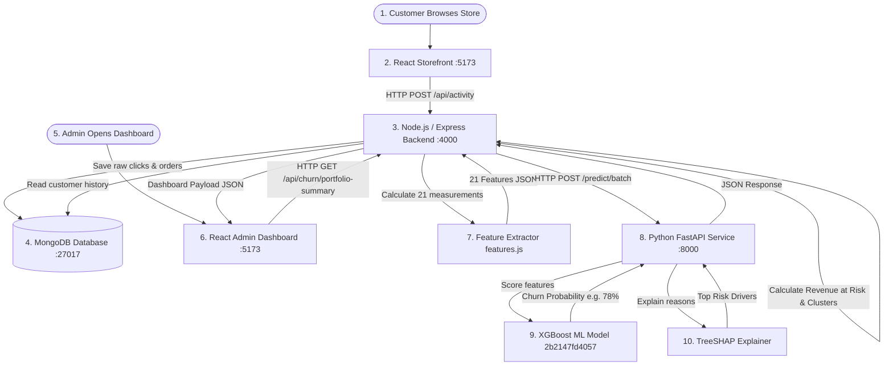

# LumaWear + ChurnIQ: Simple Teammate Guide
## How Our Whole Project Actually Works (From Front-End to Machine Learning)

> **Hey team!** This document is written in very simple English so that anyone on our team can understand our major project from start to finish. You do NOT need to be an expert in Machine Learning or advanced web architecture to understand this.

---

## 1. Our Project in One Simple Story

**What is our project?**
1. We built an online clothing store called **LumaWear**.
2. Customers visit the store, browse clothes, save items to a wishlist, add clothes to their cart, log in, and buy things.
3. Every time a customer does something on the website, our system records that action in a database called **MongoDB**.
4. We take that raw customer history and turn it into **21 meaningful behavioral measurements** (like *"How many days since they last logged in?"* or *"How much money have they spent?"*).
5. We send those 21 measurements to our trained **Machine Learning model** running on a Python service called **FastAPI**.
6. The ML model looks at the numbers and calculates a **Churn Probability** (a percentage score measuring how likely the customer is to stop shopping with us over the next 90 days).
7. Another tool called **SHAP** explains the exact reasons behind the prediction (for example: *"Risk is high because they haven't logged in for 45 days"*).
8. Our backend sends this prediction and explanation to our **React Admin Dashboard**.
9. The store manager can see which customers are at risk, see how much money is at stake (**Revenue at Risk**), and launch targeted retention campaigns (like sending a 15% discount) to win them back!

---

## 2. The Whole Project in One Diagram



### Simple Explanation of Each Box:
1. **Customer**: The person shopping for clothes on the website.
2. **React Storefront**: The web pages the customer sees and clicks on (buttons, products, cart drawer).
3. **Node.js / Express Backend**: The coordinator that receives customer actions, handles logins, processes orders, and talks to the database.
4. **MongoDB**: The master digital notebook where all customer accounts, purchases, and click activities are permanently saved.
5. **Admin**: The store manager checking store health and customer churn.
6. **React Admin Dashboard**: The private executive control room where risk scores, charts, and customer profiles are displayed.
7. **Feature Extractor (`features.js`)**: A JavaScript program that summarizes a customer's raw history into **21 clean numbers**.
8. **Python FastAPI Service**: A high-speed Python web service waiting on port 8000 to score customer features.
9. **XGBoost ML Model (`2b2147fd4057`)**: The trained AI brain that calculates the churn percentage.
10. **TreeSHAP Explainer**: The assistant that tells the manager *why* the AI gave that score.

---

## 3. What Happens When a Customer Uses Our Website?

Here is the exact step-by-step flow when a customer uses LumaWear:

```
1. Customer opens website -> React loads the clothing catalog.
2. Customer logs in -> Backend checks password, creates an `auth_login` activity in MongoDB.
3. Customer clicks a jacket -> Frontend sends `product_viewed` activity to backend -> Saved in MongoDB.
4. Customer saves an item to wishlist -> `wishlist_toggle` saved in MongoDB.
5. Customer adds item to cart -> `cart_add` saved in MongoDB.
6. Customer checks out and pays -> Backend creates an order in `orders` and logs `order_placed`.
7. Customer stops visiting for 45 days -> No new records are added to MongoDB.
8. Admin opens Churn Analytics -> React asks backend for latest risk scores.
9. Backend reads MongoDB -> Pulls the customer's account date, orders, and activity logs.
10. Backend extracts 21 features -> Calculates 45 days since last login, 0 orders this month, etc.
11. Backend calls Python FastAPI -> Sends the 21 features over an internal HTTP API.
12. XGBoost & SHAP score the customer -> Outputs 78% probability (High Risk) because of 45-day inactivity.
13. Backend computes Revenue at Risk -> Spend ($240) x 78% = $187.20 at risk.
14. React Admin Dashboard displays it -> Customer appears with a red "High Risk" badge and recommended win-back action.
```

> **Key Rule for Teammates to Remember**: The Machine Learning model does **NOT** listen to live button clicks directly from the browser! All clicks are first saved in MongoDB. Later, when the admin opens the dashboard, backend programs convert those saved clicks into 21 features and send them to the ML model.

---

## 4. What is MongoDB Doing?

Think of **MongoDB** as our application's master digital notebook. It contains 5 separate folders (called **collections**):

| Collection Name | What is stored in it? | Why do we need it? | Who writes to it? | Who reads from it? |
| :--- | :--- | :--- | :--- | :--- |
| `users` | Customer name, email, encrypted password, role, and registration date. | To manage customer accounts and calculate account age (`tenure_days`). | Storefront sign-up page (`/api/auth/register`). | Login page and Churn analytics (read-only). |
| `orders` | Order number, items bought, total price, discounts, and order date. | To track customer sales and calculate total spend, order count, and AOV. | Storefront checkout page (`/api/orders`). | Order history page and Churn analytics (read-only). |
| `activities` | Every clickstream event (`product_viewed`, `cart_add`, `auth_login`, etc.). | To measure customer engagement and 30-day activity volume for ML. | Frontend `logActivity()` via `POST /api/activity`. | Churn feature extraction engine (read-only). |
| `campaigns` | Staged marketing campaigns, target customer IDs, and suggested messages. | To record retention marketing plays created by the admin. | Admin Retention Action Center (`POST /api/churn/campaigns`). | Campaign History & Effectiveness dashboards. |
| `churn_prediction_snapshots`| Historical churn predictions captured at the moment a campaign was created. | To save a customer's baseline risk so we can compare before-vs-after risk later. | Express campaign creation endpoint. | Campaign Effectiveness dashboard. |

> **Important Integrity Rule**: Our analytics features **ONLY READ** from `users`, `orders`, and `activities`. They never modify customer accounts or order records!

---

## 5. What is Feature Extraction?

The Machine Learning model cannot understand raw sentences like *"Rahul viewed 3 shirts on Tuesday and added a jacket to his cart on Friday."* 

The model only understands **standardized numbers**. 

**Feature Extraction** is the process where our code reads raw database logs and calculates clean, meaningful summary numbers:

```
[Raw Database Records]                                    [Calculated ML Feature]
Customer clicked 12 products in last 30 days      ───►    product_views_30d = 12
Customer last signed in 18 days ago               ───►    days_since_last_login = 18
Customer placed 3 orders totaling $600            ───►    order_count = 3, total_spend = 600
Customer's favorite clothing category is Jackets  ───►    preferred_order_category = "Jackets"
```

In our project, the file [`features.js`](file:///c:/Users/vinus/OneDrive/Desktop/Majorproject/LumaWear-Ecommerce/backend/src/churn/features.js) contains the exact function `extractCustomerFeatures()` that performs this calculation in milliseconds!

---

## 6. Our 21 Features Explained Simply

Our model requires **exactly 21 features** for every customer. Here is all 21 grouped into 3 categories:

```
                                  OUR 21 FEATURES
                                         │
        ┌────────────────────────────────┼────────────────────────────────┐
        ▼                                ▼                                ▼
[A. ENGAGEMENT (10)]            [B. PURCHASING (9)]              [C. PROFILE (2)]
1. activity_event_count_30d     11. order_count                  20. tenure_days
2. days_since_last_login        12. orders_30d                   21. preferred_order_category
3. days_since_last_activity     13. days_since_last_order
4. login_count_30d              14. total_spend
5. active_days_30d              15. spend_30d
6. page_views_30d               16. average_order_value (AOV)
7. product_views_30d            17. order_frequency
8. distinct_products_viewed_30d 18. distinct_categories_ordered
9. cart_actions_30d             19. items_per_order
10. wishlist_actions_30d
```

### A. Engagement Features (How actively they use the website)
1. `activity_event_count_30d`
   - *Simple meaning*: Total number of clicks and actions in the last 30 days.
   - *Where it comes from*: `activities` collection.
   - *Why it matters*: **#1 most important feature in our model**. If someone stops clicking, they are about to leave.
2. `days_since_last_login`
   - *Simple meaning*: Days since the customer last signed in with their password.
   - *Where it comes from*: `activities` collection (`auth_login`).
   - *Why it matters*: **#2 most important feature**. Measures deliberate interest in their account.
3. `days_since_last_activity`
   - *Simple meaning*: Days since the customer did *anything* on the site (even browsing without logging in).
   - *Where it comes from*: `activities` collection.
   - *Why it matters*: Measures recent visit recency.
4. `login_count_30d`
   - *Simple meaning*: How many times they logged in during the past month.
   - *Where it comes from*: `activities` collection.
   - *Why it matters*: Frequent logins show strong shopping habits.
5. `active_days_30d`
   - *Simple meaning*: Number of different calendar days they visited this month.
   - *Where it comes from*: `activities` collection.
   - *Why it matters*: Separates a shopper who visits 5 different days from someone who clicks 20 times in one hour and never returns.
6. `page_views_30d`
   - *Simple meaning*: Number of pages loaded in the last 30 days.
   - *Where it comes from*: `activities` collection (`page_view`).
   - *Why it matters*: Measures general browsing interest.
7. `product_views_30d`
   - *Simple meaning*: Number of specific clothing product pages opened in the last 30 days.
   - *Where it comes from*: `activities` collection (`product_viewed`).
   - *Why it matters*: Shows active shopping consideration.
8. `distinct_products_viewed_30d`
   - *Simple meaning*: Number of *different* clothing items inspected.
   - *Where it comes from*: `activities` collection (`productId`).
   - *Why it matters*: High variety means they are actively looking for things to buy.
9. `cart_actions_30d`
   - *Simple meaning*: Adding or removing items from cart in the last 30 days.
   - *Where it comes from*: `activities` collection (`cart_add`).
   - *Why it matters*: High buying intent. Cart adds without orders = cart abandonment risk!
10. `wishlist_actions_30d`
    - *Simple meaning*: Items saved to wishlist in the last 30 days.
    - *Where it comes from*: `activities` collection (`wishlist_toggle`).
    - *Why it matters*: Shows items they desire but might be hesitating on price.

### B. Purchasing Features (How they spend money)
11. `order_count`
    - *Simple meaning*: Total number of successful orders they placed in their life.
    - *Where it comes from*: `orders` collection.
    - *Why it matters*: Repeat customers are much less likely to churn than one-time buyers.
12. `orders_30d`
    - *Simple meaning*: Orders placed in the last 30 days.
    - *Where it comes from*: `orders` collection.
    - *Why it matters*: Recent buyers have very low near-term churn risk.
13. `days_since_last_order`
    - *Simple meaning*: Days since their last completed purchase.
    - *Where it comes from*: `orders` collection.
    - *Why it matters*: If a customer usually buys every 20 days but hasn't bought in 70 days, they are at risk.
14. `total_spend`
    - *Simple meaning*: Total money spent across all lifetime orders.
    - *Where it comes from*: `orders` collection.
    - *Why it matters*: Measures customer value and calculates Revenue at Risk.
15. `spend_30d`
    - *Simple meaning*: Money spent in the last 30 days.
    - *Where it comes from*: `orders` collection.
    - *Why it matters*: Recent financial velocity.
16. `average_order_value` (AOV)
    - *Simple meaning*: Average dollar amount spent per order ($\text{total spend} / \text{orders}$).
    - *Where it comes from*: `orders` collection.
    - *Why it matters*: **#3 most important feature**. Identifies luxury vs budget shoppers.
17. `order_frequency`
    - *Simple meaning*: Number of orders placed per month of account age.
    - *Where it comes from*: `orders` and `users` collections.
    - *Why it matters*: Measures purchase cadence regardless of how new the account is.
18. `distinct_categories_ordered`
    - *Simple meaning*: Number of different clothing categories bought (e.g. Jackets + Shoes = 2).
    - *Where it comes from*: `orders` collection.
    - *Why it matters*: Shoppers who buy across multiple categories have higher loyalty.
19. `items_per_order`
    - *Simple meaning*: Average number of physical items in their shopping basket.
    - *Where it comes from*: `orders` collection.
    - *Why it matters*: Basket depth indicator.

### C. Profile Features (Account information)
20. `tenure_days`
    - *Simple meaning*: How many days have passed since the customer created their account.
    - *Where it comes from*: `users` collection (`createdAt`).
    - *Why it matters*: Brand new accounts have higher early drop-off rates than established accounts.
21. `preferred_order_category`
    - *Simple meaning*: The clothing category they buy most often (e.g. `"Jackets"`, `"Dresses"`).
    - *Where it comes from*: `orders` collection.
    - *Why it matters*: Allows us to send category-specific discount promotions.

---

## 7. How Do We Connect Node.js with Python?

**Question Teammates Keep Asking**: *"Did you run Python inside Node.js or did you use an API?"*

**Answer**: **YES, we use an HTTP REST API!** 

Node.js and Python are two completely separate programs running on our machine:
- **Node.js / Express** runs on **Port 4000** (handles the store and database).
- **Python FastAPI** runs on **Port 8000** (handles the Machine Learning model).

```
React Admin Dashboard (:5173)
           │
           │ 1. Admin clicks "Portfolio Analytics"
           ▼
Node.js / Express Server (:4000)
           │
           │ 2. Reads MongoDB & extracts 21 features
           │ 3. Sends HTTP POST http://127.0.0.1:8000/predict/batch
           ▼
Python FastAPI Service (:8000)
           │
           │ 4. Feeds 21 features to XGBoost model
           │ 5. Calculates SHAP explanations
           │ 6. Returns HTTP 200 JSON response
           ▼
Node.js / Express Server (:4000)
           │
           │ 7. Computes Revenue at Risk & returns data to React
           ▼
React Admin Dashboard (:5173) (Displays risk cards and customer table)
```

### What Simple Words Mean:
- **HTTP**: The standard messaging language used by web programs to talk to each other over a network.
- **REST API**: A clean way to organize those messages using standard actions like `GET` (ask for data) and `POST` (send data to be processed).
- **JSON**: A universal text format that looks like organized key-value notes that both JavaScript and Python can easily read:

```json
// What Node.js sends to Python:
{
  "customers": [
    {
      "user_id": "u-101",
      "tenure_days": 142,
      "days_since_last_login": 45,
      "activity_event_count_30d": 0,
      "total_spend": 240.0
    }
  ]
}

// What Python sends back to Node.js:
{
  "predictions": [
    {
      "customer_id": "u-101",
      "churn_probability": 0.8142,
      "risk_level": "Very High",
      "top_shap_features": [
        { "feature": "days_since_last_activity", "shap_value": 0.52, "direction": "increases_churn" }
      ]
    }
  ]
}
```

---

## 8. How Does the ML Model Predict Churn?

### What is XGBoost?
**XGBoost** is a smart algorithm made of a team of **300 decision trees**. 
Think of decision trees like a game of 20 questions:
- *Has the customer visited in the last 14 days?* $\rightarrow$ **NO** (Go right).
- *Did they place an order in the last 30 days?* $\rightarrow$ **NO** (Go right).
- *Is their total spend high?* $\rightarrow$ **YES** (Slightly adjust risk down).

All 300 trees vote together to produce a single **continuous probability** between `0.0` (0% risk) and `1.0` (100% risk).

### What Does 78% Probability Mean?
If the model outputs `0.78` (78% churn probability), it means:
> *"Out of 100 past customers who behaved exactly like this, 78 of them stopped buying in the next 90 days."*

It does **NOT** mean the customer is 100% guaranteed to leave. They still have a 22% chance of staying.

---

## 9. Why is One Customer High Risk and Another Low Risk?

```
+----------------------------------------------------------------------------------------------------+
|                                 CUSTOMER COMPARISON EXAMPLE                                        |
|                                                                                                    |
|  Customer A (Active, Loyal Shopper)                 Customer B (Disengaged, High Risk)             |
|  • Visited yesterday (days_since_activity = 1)      • Has not visited in 45 days                   |
|  • 25 clicks this month (activity_30d = 25)         • 0 clicks this month (activity_30d = 0)       |
|  • Bought last week (orders_30d = 1)                • 0 orders in 60 days                          |
|  • Total spend = $850                               • Abandoned $240 jacket in cart                |
|                                                                                                    |
|  ──► Predicted Churn: 8.5% (LOW RISK)               ──► Predicted Churn: 81.4% (VERY HIGH RISK)    |
+----------------------------------------------------------------------------------------------------+
```

### The 4 Risk Tiers in Our Project:
- **Low Risk**: $P < 0.25$ (Under 25%) $\rightarrow$ Happy customer, do not disturb.
- **Medium Risk**: $0.25 \le P < 0.50$ (25% to 50%) $\rightarrow$ Send automated product recommendations.
- **High Risk**: $0.50 \le P < 0.75$ (50% to 75%) $\rightarrow$ Send targeted 15% discount campaign.
- **Very High Risk**: $P \ge 0.75$ (Over 75%) $\rightarrow$ Immediate VIP win-back outreach!

---

## 10. What is SHAP? (Explaining the Score)

**Prediction tells us WHAT the risk is (e.g. 78%).**  
**SHAP tells us WHY the risk is 78%.**

Think of SHAP as a tug-of-war game between two teams:
- **Team Churn (Pushes risk UP)**: Long inactivity (+0.52), 0 events this month (+0.41).
- **Team Stay (Pushes risk DOWN)**: High past spend (-0.18), long account age (-0.09).

```
Baseline Average Risk (30%)
   ├── [+] Customer hasn't logged in for 45 days (+35%)  ──► Pushes risk UP
   ├── [+] Zero clicks this month (+20%)                 ──► Pushes risk UP
   └── [-] High past spend of $500 (-7%)                 ──► Pulls risk DOWN
   ─────────────────────────────────────────────────────
   Final Output Churn Probability = 78% (High Risk)
```

Because of SHAP, our admin dashboard doesn't just show a raw number; it shows exact badges like **"Driven by: Days Since Last Activity (+0.52)"**.

---

## 11. How Does the Admin Dashboard Work?

React does not calculate Machine Learning numbers itself. It asks Express, Express asks Python, and React simply renders the results:

```
1. React Admin Dashboard asks Express: "Give me the latest churn portfolio summary."
2. Express queries MongoDB, extracts 21 features, and calls FastAPI.
3. FastAPI runs XGBoost + SHAP and returns the probabilities and reasons.
4. Express calculates financial metrics and sends clean JSON to React.
5. React renders 7 different tabs for the store manager!
```

### The 7 Dashboard Views We Built:
1. **Churn Risk Analytics**: Shows total customer count, average churn rate, 4 risk tier cards, top global drivers chart, and a searchable customer table.
2. **Business Impact**: Shows how much real money is at risk (**Revenue at Risk**), broken down by risk tier.
3. **Retention Action Center**: Displays **7 smart action clusters** (like *Cart Abandonment Recovery* or *VIP Retention*) with suggested discount messages.
4. **Campaign History**: Shows all past campaigns created by the manager and their status (`PLANNED`, `SENT`, `COMPLETED`).
5. **Customer Accounts**: Shows raw registered users and order counts.
6. **Model Health & MLOps**: Checks server speed (latency), confirms the active AI model is working, and monitors for data drift (**PSI**).
7. **Retention Effectiveness**: Shows if customer risk dropped after a campaign was sent (before-vs-after risk tracking).

---

## 12. Business Impact: What is Revenue at Risk?

Executives don't just care about percentages; they care about **money**. 

We calculate **Revenue at Risk** using this simple formula:

$$\text{Revenue at Risk} = \text{Customer Lifetime Spend} \times \text{Predicted Churn Probability}$$

### Easy Example:
- A customer spent **$1,000** with us in the past.
- The ML model says their churn probability is **70% ($0.70$)**.
- **Estimated Revenue at Risk** = $\$1,000 \times 0.70 = \mathbf{\$700}$.

> **Note for Teammates**: This does **NOT** mean we are guaranteed to lose $700 tomorrow. It is an **exposure estimate** that helps the store manager prioritize which high-spending customers to rescue first!

---

## 13. Customer 360: The Complete Dossier

When an admin clicks **"Customer 360"** on any customer row, our system gathers everything about that customer into one single screen:

```
[Customer Profile]         ──► Name, Email, Registration Date, Preferred Category
[Risk Assessment]          ──► 78% Churn Probability, Very High Risk, 90-day Timeline
[SHAP Top Drivers]         ──► Inactivity (+0.52), Zero events (+0.41), Spend (-0.18)
[Financial Metrics]        ──► Lifetime Spend ($240), AOV ($120), Revenue at Risk ($187)
[Chronological Journey]    ──► Signed up ──► Viewed 6 items ──► Bought Parka ──► Inactive 45d
[21-Feature Telemetry]     ──► Full grid of Engagement, Purchasing, and Profile numbers
[Order History Ledger]     ──► Itemized table of past receipts and line items
```

---

## 14. Model Health & MLOps: Detecting Data Drift

We don't just train an AI model and forget about it. We continuously monitor it on the **Model Health** dashboard:

1. **Server Speed (Latency)**: We measure how fast our servers respond (Express: 1ms, MongoDB: 4ms, FastAPI: 12ms).
2. **Missing Data**: We check if any of the 21 features have missing or corrupt values.
3. **Data Drift (PSI — Population Stability Index)**:
   - *What is Data Drift?* When customer shopping behavior today looks completely different from the customers we trained the model on.
   - *Example*: During training, most customers visited 20 times a month. If today's customers suddenly visit only 2 times a month, the input distribution has shifted.
   - *PSI Thresholds*: $\text{PSI} < 0.10$ is Stable, $0.10 \le \text{PSI} < 0.25$ is a Warning, and $\text{PSI} \ge 0.25$ means Significant Drift.

---

## 15. Retention Effectiveness: Did Our Campaigns Work?

When the store manager sends a campaign, we want to know: **"Did customer risk actually go down?"**

```
1. Before Campaign: Customer risk is recorded as 82% (Baseline Snapshot).
2. Manager sends "Winter Win-Back" email with 15% discount.
3. Customer receives email, logs in, and buys a sweater.
4. After Campaign: Model rescores customer live -> New risk is 42% (Latest).
5. Risk Reduction Delta: ΔP = 82% - 42% = +40% Risk Reduction!
6. UI displays badge: "Very High Risk ──► Medium Risk (Effective)".
```

> **Important Scientific Note**: This before-vs-after comparison is **observational evidence**. To mathematically prove that the email *caused* the purchase (and the customer didn't just return on their own), a store must run an A/B holdout test (which we model in our Experiment Simulator).

---

## 16. What We Built from Phase 1 to Phase 12

| Phase | What We Added | Why We Needed It |
| :--- | :--- | :--- |
| **Phase 1** | Storefront & Shopping Cart | Core e-commerce foundation for browsing, cart, and checkouts. |
| **Phase 2** | Real-Time Activity Logging | Captures clicks, page views, and logins into MongoDB `activities`. |
| **Phase 3** | 21-Feature Extraction Engine | Converts raw DB records into 21 clean numbers with zero future leakage. |
| **Phase 4** | XGBoost Model Training | Trains our AI on 7,912 historical snapshots, reaching an **ROC-AUC of 0.837**. |
| **Phase 5** | TreeSHAP Explainability | Calculates exact additive reasons behind each customer's risk score. |
| **Phase 6** | Python FastAPI ML Service | High-speed Python microservice serving predictions on port 8000. |
| **Phase 7** | Node.js $\leftrightarrow$ Python Integration | Connects Express to FastAPI over internal HTTP REST with timeouts. |
| **Phase 8** | Portfolio Churn Dashboard | Visualizes store-wide risk tiers, KPI cards, and customer tables. |
| **Phase 9** | Retention Action Center | Groups at-risk customers into 7 action clusters and stages campaigns. |
| **Phase 10** | Business Impact & Customer 360 | Calculates Revenue at Risk ($\text{Spend} \times P$) and full customer dossiers. |
| **Phase 11** | Model Health & MLOps Monitoring | Monitors API speed, artifact integrity, and PSI data drift. |
| **Phase 12** | Retention Effectiveness Tracking | Tracks before-vs-after risk reduction ($\Delta P$) and simulates campaign ROI. |

---

## 17. 50 Questions My Teammates May Ask (With Simple Answers)

**1. Where is the customer data stored?**  
In our local MongoDB database running on port 27017 across collections like `users`, `orders`, and `activities`.

**2. How do we get the 21 features?**  
Our Node.js backend reads MongoDB history and runs `extractCustomerFeatures()` in `features.js` to calculate 21 numbers.

**3. Are the 21 features manually entered by a human?**  
No! They are automatically computed in real time from raw timestamps and click logs.

**4. Does React calculate the features?**  
No, React is just the visual frontend. The Node.js backend calculates the features.

**5. Does MongoDB calculate the features?**  
No, MongoDB only stores the raw records. Node.js does the math in memory.

**6. Which backend calculates the features?**  
Node.js (`features.js`) calculates the 21 features and forwards them to Python.

**7. How does Node.js communicate with Python?**  
Through an internal HTTP REST API. Node sends a `POST` request to `http://127.0.0.1:8000/predict/batch` with JSON data.

**8. Is FastAPI a database?**  
No, FastAPI is a high-speed Python web framework used to host our Machine Learning model.

**9. Why didn't we put the ML model directly inside Node.js?**  
Because Python has the best, C-optimized machine learning tools (Scikit-Learn, XGBoost, SHAP). Node.js is better suited for web traffic and database queries.

**10. Why are we using Python for ML?**  
Python is the industry standard for AI, offering superior libraries and native tree-explainability support.

**11. How does XGBoost receive the data?**  
FastAPI receives the 21 features via JSON, turns them into a table (DataFrame), and passes them to XGBoost.

**12. What does the ML model return?**  
A continuous churn probability (like `0.7824`), a risk tier (`"High"`), and SHAP feature drivers.

**13. Where is the ML model stored?**  
On disk as a pre-trained file (`churn_pipeline.joblib`) inside `ChurnProject/artifacts/2b2147fd4057/`.

**14. What is our active model ID?**  
`2b2147fd4057`.

**15. Does the model retrain on every request?**  
No, it is trained once offline. During live web requests, it only makes instant, read-only predictions.

**16. What is churn probability?**  
A percentage from 0% to 100% estimating how likely a customer is to stop buying over the next 90 days.

**17. Why is someone's probability 80%?**  
Because their combination of 21 features (like long inactivity and 0 recent orders) matches historical customers who stopped buying.

**18. Does 80% mean they will definitely leave?**  
No, it is a statistical estimate. The customer still has a 20% chance of staying.

**19. What is the single most important feature in our model?**  
`activity_event_count_30d` (30-day activity count), with an importance score of `0.6102`.

**20. How do we know why a customer is high risk?**  
Through **SHAP**, which measures the exact positive and negative contribution of each feature to the final score.

**21. What is SHAP?**  
A mathematical tool that explains the reasons behind an AI decision (like a tug-of-war showing which habits pushed risk up or down).

**22. How does Business Impact calculate Revenue at Risk?**  
By multiplying lifetime spend by predicted churn probability ($\text{Spend} \times P$).

**23. Is Revenue at Risk guaranteed lost money?**  
No, it is an financial exposure metric to help managers prioritize high-value at-risk accounts.

**24. How does Customer 360 get all its information?**  
Express queries `users`, `orders`, `activities`, and `campaigns` in parallel, extracts 21 features, gets live ML scores, and displays a complete dossier.

**25. Does the React dashboard connect directly to MongoDB?**  
No! React only talks to Express APIs. Direct database access from the browser would be a major security risk.

**26. Does React connect directly to FastAPI?**  
No, React talks to Express, and Express talks to FastAPI. Express acts as the secure API Gateway.

**27. What happens if FastAPI is down?**  
Express catches the timeout via `AbortController` and displays a clean 503 error banner without crashing the store.

**28. What happens if MongoDB is down?**  
The website displays an error saying the database connection is unavailable.

**29. How does Model Health detect drift?**  
By calculating **Population Stability Index (PSI)**, comparing current customer numbers against the 7,912 training examples.

**30. What is PSI?**  
A formula that measures if customer behavior has shifted compared to the training data.

**31. What is Retention Effectiveness?**  
A dashboard that tracks before-vs-after risk reduction ($\Delta P = P_{\text{baseline}} - P_{\text{latest}}$) after a campaign is sent.

**32. What is the difference between 21 raw features and 29 post-OHE features?**  
The 1 text feature (`preferred_order_category`) is converted into 8 binary columns inside Python (One-Hot Encoding).

**33. What happens if a customer has 0 orders?**  
Missing values default to `null`, and our preprocessor fills them with median values learned during training.

**34. What is data leakage?**  
When an AI accidentally peeks at future data during training. We prevented this using strict cutoff dates (`asOfDate`).

**35. What is the prediction horizon?**  
Strictly **90 days**.

**36. What is Demo Mode?**  
An in-memory simulation using 12 pre-configured personas to demo all 4 risk tiers without modifying live database records.

**37. What are the 4 risk tiers?**  
Low (<25%), Medium (25-50%), High (50-75%), and Very High (≥75%).

**38. What are the 7 retention clusters?**  
Cart Abandonment, Inactivity Re-engagement, Wishlist Follow-up, Product Recs, New Onboarding, VIP Retention, and Category Promotions.

**39. How is password security handled?**  
Passwords are encrypted using cryptographic salt and hash (`crypto.scryptSync()`).

**40. What is the ROC-AUC score of our model?**  
**0.837** across 5-fold cross-validation.

**41. What is an API?**  
A digital messenger that allows two programs (like Node and Python) to talk to each other.

**42. What is JSON?**  
A clean text format of key-value pairs used to exchange data between Node and Python.

**43. What is Single-Page Application (SPA)?**  
A React website that updates content dynamically without reloading the browser page.

**44. What is a baseline snapshot?**  
A saved copy of a customer's churn risk at the exact moment a campaign is staged.

**45. What does $\Delta P$ mean?**  
The risk reduction score: $\Delta P = P_{\text{before}} - P_{\text{after}}$.

**46. Is campaign success proof of causality?**  
No, before-vs-after tracking is observational. Proving causality requires an A/B holdout test.

**47. What is AOV?**  
Average Order Value ($\text{Total Spend} / \text{Order Count}$).

**48. Why do we use JWT tokens?**  
To securely verify user identity and ensure only admins can access the churn dashboard.

**49. How many trees are in our XGBoost model?**  
300 gradient boosted trees.

**50. What is the main achievement of this project?**  
Connecting a live e-commerce storefront, real-time data engineering, machine learning scoring, and business retention actions into one working platform!

---

## 18. "Explain This to Me Like I'm New" (The Story of Rahul)

Let's follow one customer named **Rahul**:

```
1. Rahul signs up on LumaWear and creates an account.
2. Rahul browses 6 jackets and adds a Winter Parka to his wishlist.
3. Rahul adds the Parka ($240) to his cart and buys it.
4. Everything Rahul did is logged in MongoDB.
5. Rahul gets busy and stops visiting LumaWear for 45 days.
6. 45 days later, store admin opens the Churn Dashboard.
7. Node.js backend reads Rahul's history and calculates his 21 features:
   - days_since_last_login: 45
   - activity_event_count_30d: 0
   - total_spend: $240
8. Node.js sends these numbers to Python FastAPI.
9. XGBoost evaluates the numbers and says: "81.4% Churn Probability (Very High Risk)".
10. SHAP explains: "Risk is high because of 45 days of inactivity (+0.52)".
11. Dashboard displays Rahul with a red badge and warns that $195 is at risk.
12. Admin clicks "Stage Campaign" and sends Rahul an email with a 15% comeback discount.
13. Baseline snapshot saves Rahul's risk as 81.4%.
14. Rahul gets the email, logs in, and buys a $120 fleece.
15. Admin checks Retention Effectiveness: Rahul's risk dropped from 81.4% to 18.5% (Effective Reduction!).
```

---

## 19. My 1-Minute Teammate Pitch

> *"Hey everyone! Our project is called **LumaWear ChurnIQ**. It's an online clothing store integrated with a live Customer Churn Prediction AI.
> 
> When customers shop on our React storefront, our Node.js backend records their clicks, logins, and orders in MongoDB.
> 
> When an admin opens the dashboard, our backend extracts **21 behavioral measurements**—like how many days since their last visit and how much they spent—and sends them over an internal REST API to our Python FastAPI service.
> 
> FastAPI runs our trained **XGBoost model (ROC-AUC 0.837)**, which calculates a 90-day churn probability and uses **SHAP** to explain the exact reasons behind the score.
> 
> Finally, our React admin dashboard shows risky customers, calculates **Revenue at Risk**, and helps managers launch targeted retention campaigns to win customers back!"*

---

## 20. My 3-Minute Teammate Pitch

> *"Our project bridges the gap between full-stack e-commerce and machine learning operations.
> 
> On the frontend, we built **LumaWear**, a React single-page storefront where shoppers browse clothes, manage carts, and checkout.
> 
> In the backend, we built a dual-service architecture:
> 1. A **Node.js/Express backend** connected to MongoDB that handles authentication, order transactions, and real-time clickstream logging.
> 2. A **Python FastAPI microservice** that hosts our active XGBoost churn model and TreeSHAP explainer.
> 
> When an admin opens the dashboard, Node.js extracts **21 point-in-time features** with zero future data leakage and dispatches a batch request to FastAPI.
> 
> XGBoost scores the customer across 300 decision trees to produce a continuous churn probability mapped into 4 risk tiers: Low, Medium, High, and Very High. TreeSHAP breaks down the exact positive and negative drivers behind the prediction.
> 
> In our admin dashboard, we translate this AI into real business value:
> - In **Business Impact**, we calculate **Revenue at Risk** by multiplying spend by churn risk.
> - In **Retention Action Center**, we match at-risk shoppers to **7 automated action clusters**.
> - In **Customer 360**, managers see full customer dossiers with journey timelines and 21-feature telemetry.
> - In **Retention Effectiveness**, we track before-vs-after risk reduction ($\Delta P$) using baseline snapshots.
> - And in **Model Health**, we monitor server speeds and **Population Stability Index (PSI)** to catch data drift.
> 
> It's a complete, working, end-to-end intelligence platform!"*

---

## 21. Super Short Cheat Sheet

### Our Tech Stack:
- **Frontend**: React 18, Vite, React Router, CSS / Tailwind.
- **Backend**: Node.js, Express, Mongoose, JWT Auth.
- **Database**: MongoDB (Collections: `users`, `orders`, `activities`, `campaigns`, `churn_prediction_snapshots`).
- **ML Framework**: Python 3.10+, FastAPI, Scikit-Learn, XGBoost, SHAP.
- **Active Model ID**: `2b2147fd4057` (5-fold CV ROC-AUC: `0.837`).
- **Connection**: Internal HTTP REST API (`localhost:4000` $\leftrightarrow$ `localhost:8000`).

### The Main Flow:
$$\text{Customer Click} \longrightarrow \text{React} \longrightarrow \text{Express} \longrightarrow \text{MongoDB} \longrightarrow \text{21 Features} \longrightarrow \text{FastAPI} \longrightarrow \text{XGBoost} \longrightarrow \text{Prediction} \longrightarrow \text{Dashboard}$$

### Key Vocabulary:
- **API**: A digital messenger connecting Node.js and FastAPI over HTTP.
- **FastAPI**: The fast Python server running our ML model.
- **Feature**: A clean number summarizing customer behavior.
- **XGBoost**: The 300-tree AI model predicting churn.
- **Churn**: A customer placing zero orders over the next 90 days.
- **SHAP**: The tool explaining *why* the AI gave that score.
- **Revenue at Risk**: $\text{Spend} \times \text{Churn Probability}$.
- **Customer 360**: Full customer profile, risk, journey, and telemetry in one place.
- **PSI**: A formula checking if customer habits have drifted away from training data.
